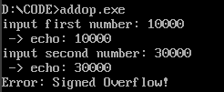
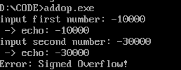
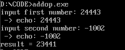
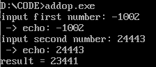
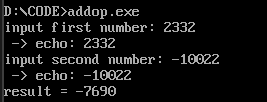
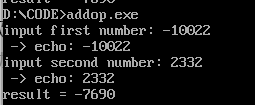

# exercise 2
任务内容：

实现有符号数加法运算，发生溢出时（OF=1）能报错（数据宽度自定义，字节，字都可以）
## 基本要求
代码：addop.asm

输入数字要求是16位有符号数（-32768~32767）

输出示例：

### first number=30000 second number=10000

### first number=-30000 second number=-10000

### first number=24443 second number=-1002

### first number=-1002 second number=24443

### first number=2332 second number=-10022

### first number=-10002 second number=2332
