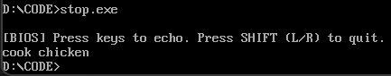
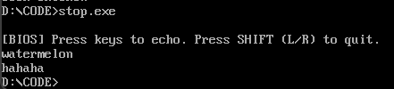
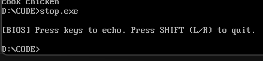
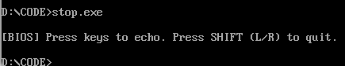

# exercise 3
任务内容：

1. 要求调用BIOS的键盘中断int 16h和int 10h显示中断，获取按键信息并显示对应字符，直到用户按下shift键（包括左右任何一个）后结束该程序
2. 了解int 21号中断和BIOS中断的关系，改作业不允许使用int 21中断

## 一、基本要求
代码：stop.asm

## 二、输出实例

### 输入：cook chicken+右shift

### 输入：watermelon+回车+hahaha+左shift

### 输入：右shift

### 输入：左shift

## 三、int 21号中断和BIOS中断的关系

### 1. 核心关系：封装与依赖

DOS 中断（如 INT 21h）是建立在 BIOS 中断之上的高级接口。 DOS (Disk Operating System) 操作系统为了方便程序员开发，对底层的 BIOS 功能进行了封装和抽象。

- BIOS 中断：直接驱动硬件（显卡、键盘、磁盘控制器）。它是“硬件的驱动程序”。
- INT 21h：DOS 提供的系统调用（System Call）。它在执行过程中，往往会在内部调用 BIOS 中断来完成最终的硬件操作。

### 2. 系统层级架构

在计算机软件系统中，它们处于不同的层级，自上而下依次为：

1. 应用程序：你的汇编代码。
2. DOS 内核 (INT 21h)：提供文件系统、内存管理、标准输入输出等高级功能。
3. BIOS (INT 10h, 16h, 13h 等)：固化在主板 ROM 中的基本输入输出系统，提供最底层的硬件控制功能。
4. 硬件 (Hardware)：CPU、显示器、键盘、磁盘等。

#### 3. 举例说明

- **显示字符**：
  - **DOS 方式**：调用 `INT 21h, AH=09h` 打印字符串。DOS 内部会负责循环读取内存，判断 `$` 结束符，并一次次调用 BIOS。
  - **BIOS 方式**：调用 `INT 10h, AH=0Eh`。这是本次作业使用的方式，程序员必须自己写循环，自己处理字符光标移动。
- **读取文件**：
  - **DOS 方式**：通过文件名（如 "TEST.TXT"）打开文件。DOS 负责解析 FAT 文件系统。
  - **BIOS 方式**：必须指定磁头号、柱面号、扇区号来读取磁盘物理数据。BIOS 不认识“文件名”的概念。

#### 4. 为什么要绕过 INT 21h？

本次实验要求禁止使用 INT 21h，目的是为了让开发者跳过操作系统的抽象层，直接学习如何与硬件（通过 BIOS）进行交互。这能帮助理解计算机底层的“中断驱动”机制，以及操作系统是如何通过封装底层调用来简化上层开发的。