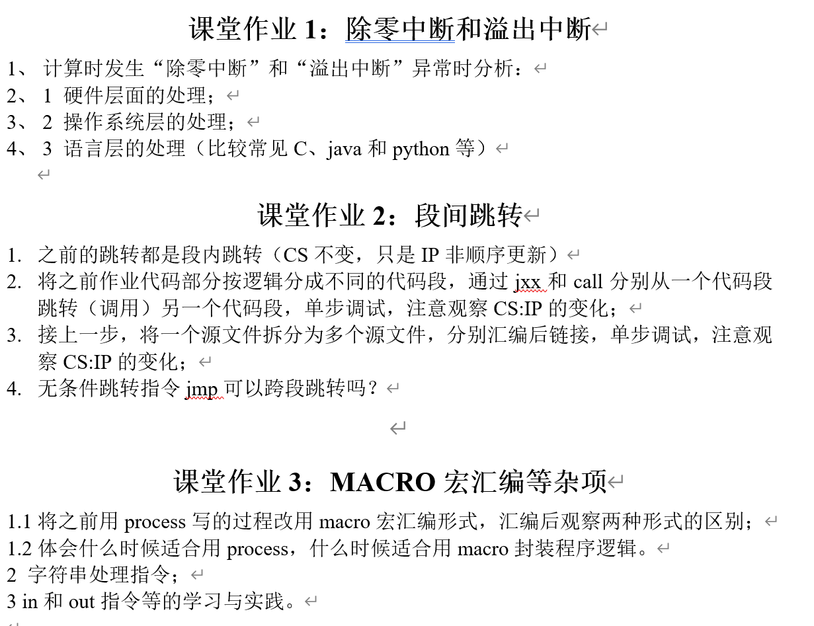

# exercise 4

## 任务要求：

## 课堂作业1：除零中断和溢出中断

### 1.1 异常发生时机与现象分析

#### （1）除零中断（Divide Error，对应 INT 0）

在 8086 中执行 `DIV` 或 `IDIV` 时出现以下情况会触发 **INT 0**：

1. 除数为 0；
2. 商的结果超出目标寄存器可表示范围（例如 8 位除法要求商在 AL，16 位除法要求商在 AX，若溢出则同样触发 INT 0）。

该中断属于 CPU 对除法指令的硬件级保护机制，一旦触发会立即转入中断处理流程。

#### （2）溢出中断（Overflow，对应 INT 4，需 INTO 触发）

8086 的算术指令（如 `ADD/SUB/IMUL`）若发生有符号溢出，仅会置位标志位 OF=1，并不会自动中断。
 只有当程序显式执行 `INTO` 指令时，CPU 才会检查 OF：

- 若 OF=1，则触发 **INT 4**；
- 若 OF=0，则继续顺序执行。

因此溢出中断本质上是“程序员可控”的异常机制：先由硬件设置 OF，再由 INTO 决定是否进入中断。

------

### 1.2 硬件层面的处理流程

当触发 INT n 时，8086 的典型动作如下：

1. 将 **FLAGS、CS、IP** 依次压栈（保存现场与返回点）；
2. 从中断向量表（IVT）中取出中断入口地址，更新 CS:IP 跳转执行。

中断向量表位于实模式内存 **0000:0000**，每个中断向量占 4 字节：

- 偏移地址（IP）占 2 字节：存放在 `0000:(4*n)`；
- 段地址（CS）占 2 字节：存放在 `0000:(4*n+2)`。

因此设置或读取中断向量时常见写法为：

- `mov word ptr es:[4*n], offset isr`
- `mov word ptr es:[4*n+2], cs`

------

### 1.3 操作系统层面的处理

在 DOS 默认环境中，如果不自行改写 IVT：

- INT 0 通常会导致系统给出除法错误提示并终止程序或返回 DOS；
- INT 4 若被触发，也会进入系统默认处理，通常表现为终止或错误提示（具体依 DOSBox/调试器实现略有差异）。

在实验中更常见的做法是：
 **安装自定义 ISR（中断服务程序）**，在 ISR 中输出提示信息（例如 BIOS `int 10h` 显示或者`int 21h`），并选择：

- 返回继续执行（`iret`）；
- 或在 ISR 内/主流程中执行退出（如 `INT 20h` 或 `retf` 到 PSP:0000）。

------

### 1.4 语言层面的处理对比（C / Java / Python）

#### （1）除零

- **C**：整数除 0 属于未定义行为，可能崩溃或出现不可预期结果；
- **Java**：抛出 `ArithmeticException: / by zero`；
- **Python**：抛出 `ZeroDivisionError`。

#### （2）溢出

- **C**：有符号溢出一般视为未定义行为；无符号溢出按模回绕；
- **Java**：`int/long` 默认回绕，不抛异常（除非使用 `Math.addExact` 等检查方法）；
- **Python**：整数为任意精度，通常不会溢出（受内存限制）。

------

### 1.5 小结

- **除零中断 INT 0**：由 `DIV/IDIV` 硬件自动触发（除数为 0 或商溢出）。
- **溢出中断 INT 4**：需要 `INTO` 才会触发，本质是“OF 标志 + INTO 指令”的组合机制。
- 8086 通过 IVT（0000:0000）完成中断入口分派，向量项结构为 IP（2Byte）+CS（2Byte）。

## 二、课堂作业2：段间跳转

### 2.1 段内跳转的特点

常见的 `jxx label`、`jmp label`、`call label`（默认形式）大多为 **near（段内）**：

- **CS 不变**；
- **IP 改变**（跳转到同一代码段内的新偏移）。

因此段内跳转的本质是“同段内改变执行位置”，非常适合在调试时观察 IP 的非顺序变化。

------

### 2.2 段间跳转/调用的实现方式与观察点

要使 CS 改变，必须使用 **far（段间）** 跳转/调用，并且目标需要位于不同代码段：

- `jmp far ptr target`：同时改变 CS:IP；
- `call far ptr target`：同时改变 CS:IP，并将返回地址的 CS:IP 压栈；
- 返回必须使用 `retf`（远返回）才能把 CS:IP 成对弹出恢复。

在单步调试时，CS:IP的变化为：

- 发生跳转瞬间，CS 与 IP 同时改变；
- 若为 `call far`，栈顶将出现“返回用CS:IP”。

------

### 2.3 多文件汇编链接与 CS:IP 变化关系

将一个源文件拆为多个源文件并分别汇编链接，本身并不必然导致段间跳转。
 是否段间跳转取决于：

1. 是否定义了多个独立 `CODE SEGMENT` 并形成不同段；
2. 跳转/调用使用的是 near 还是 far；
3. 链接后的段布局结果（调试中可看到段地址变化）。

------

### 2.4 问题：无条件跳转 jmp 可以跨段跳转吗？

结论：可以，但必须使用 far 形式。

- `jmp label`：near，不跨段（CS 不变）；
- `jmp far ptr seg:off` 或 `jmp far ptr target`：far，可跨段（CS 改变）。

------

### 2.5 小结

- 段内跳转：CS 不变，只改 IP。
- 段间跳转：必须使用`far`，使得CS:IP均改变；具体则是采用`call far` 搭配 `retf`的方法。

## 课堂作业3：MACRO宏汇编等杂项

### 3.1 PROC 与 MACRO 的差异

#### （1）PROC（过程）

- 过程代码只存在一份；
- 通过 `call` 进入，`ret/retf` 返回；
- 有调用开销（压栈/弹栈，可能需保存寄存器）；
- 优点：结构清晰、可复用、体积小。

#### （2）MACRO（宏）

- 每次使用会把宏体直接“展开”到调用处，相当于复制粘贴；
- 不需要 call/ret，运行时无调用开销；
- 缺点：频繁使用会增大代码体积；调试时会看到重复的指令块。

------

### 3.2 何时用 PROC，何时用 MACRO

- 更适合 PROC 的情形：逻辑较大、复用次数多、希望减少体积、希望调用结构清晰。
- 更适合 MACRO 的情形：逻辑很短、调用极其频繁、希望避免 call/ret 开销（如快速输出单字符、简短寄存器保存恢复模板等）。

------

### 3.3 字符串处理指令要点

8086 字符串指令依赖固定寄存器与方向标志 DF：

- 源地址：DS:SI
- 目的地址：ES:DI
- 方向控制：DF（`CLD` 递增，`STD` 递减）

常用字符串指令：

- `MOVSB/MOVSW`：从 DS:SI 复制到 ES:DI
- `STOSB/STOSW`：把 AL/AX 存到 ES:DI
- `LODSB/LODSW`：从 DS:SI 取到 AL/AX
- `SCASB/SCASW`：AL/AX 与 ES:DI 比较（常用于查找）
- `CMPSB/CMPSW`：比较 DS:SI 与 ES:DI

配合重复前缀：

- `REP`：重复 CX 次
- `REPE/REPZ`：相等时继续重复
- `REPNE/REPNZ`：不相等时继续重复

------

### 3.4 in/out 指令学习与实践

端口 I/O 指令用于访问硬件 I/O 端口（或模拟端口）：

- `IN AL,imm8` / `OUT imm8,AL`：端口号为 8 位立即数
- `IN AL,DX` / `OUT DX,AL`：端口号由 DX 提供（范围更灵活）

------

### 3.5 小结

- PROC 侧重复用与结构，MACRO 侧重展开与性能；
- 字符串指令的核心是 DS:SI、ES:DI、DF 与 REP 前缀；
- in/out 是端口 I/O 的基础，IN 从指定 I/O 端口读入数据到 AL/AX；OUT 将 AL/AX 数据写到端口；它们用于与外设交换信息，支持立即数端口或 DX 寻址。