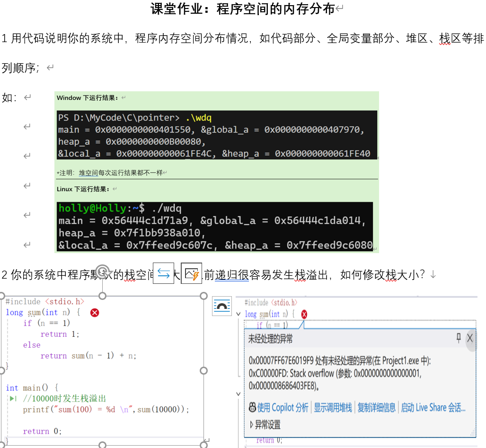
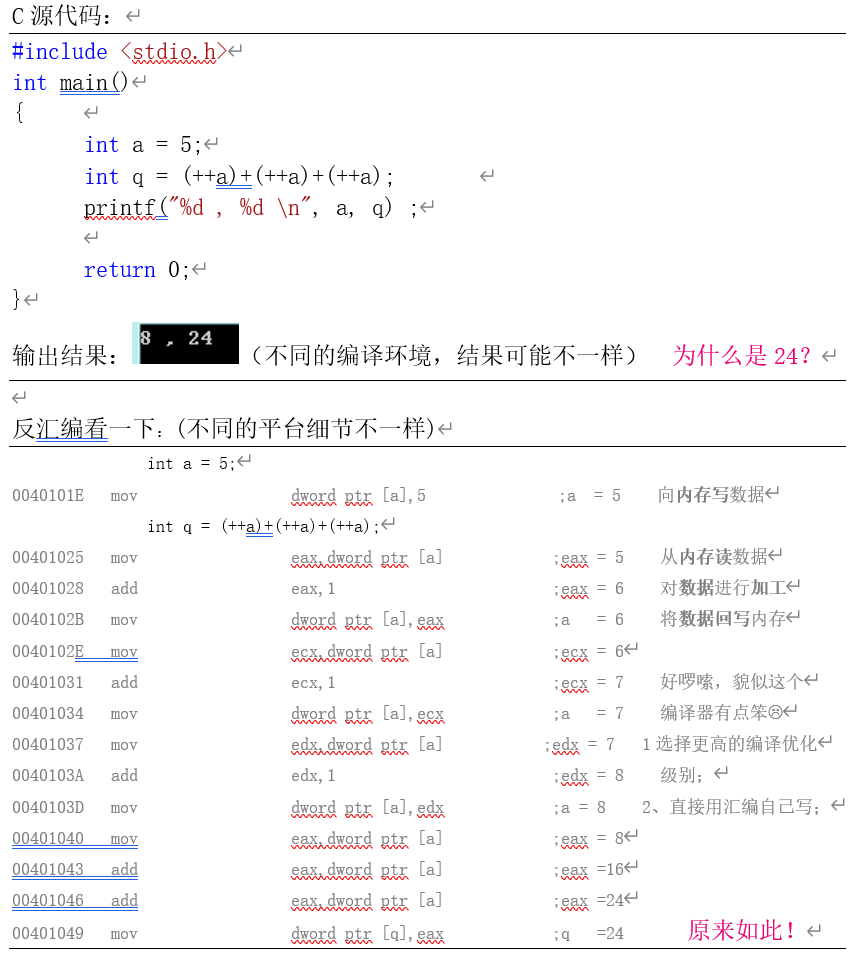
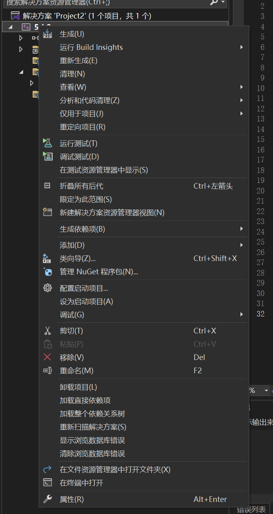
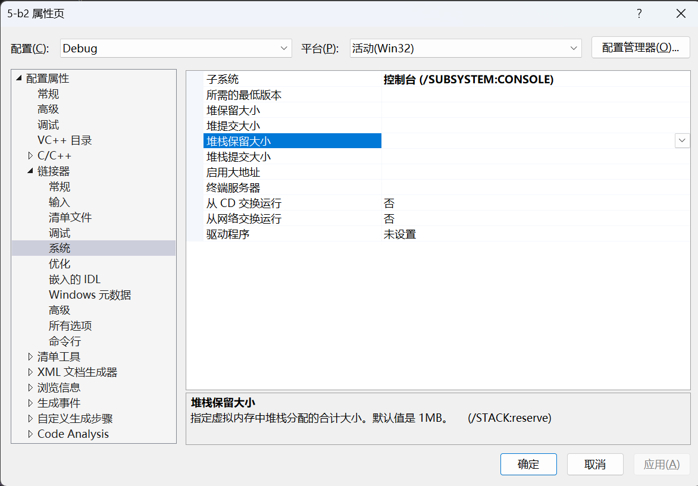
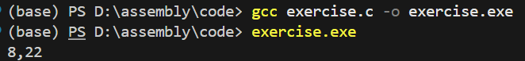

# exercise 5

## 任务要求：



## 程序的空间分布
代码：memory.c
代码如下：
```
/* 已初始化的全局变量 —— 位于 .data 段 */
int global_init = 123;

/* 未初始化的全局变量 —— 位于 .bss 段 */
int global_uninit;

/* 函数本身 —— 位于代码段（text segment） */
void test_function(void) {
    int stack_var = 456;                 // 栈区变量
    int *heap_var = malloc(sizeof(int)); // 堆区变量

    *heap_var = 789;

    printf("======== 进程内存空间分布示例 ========\n\n");

    printf("【代码段（Text Segment）】\n");
    printf("  函数 test_function 的地址：%p\n\n", (void *)test_function);

    printf("【全局 / 静态区（Global / Static Segment）】\n");
    printf("  已初始化全局变量 global_init 地址：%p\n", (void *)&global_init);
    printf("  未初始化全局变量 global_uninit 地址：%p\n\n", (void *)&global_uninit);

    printf("【堆区（Heap Segment）】\n");
    printf("  malloc 分配的 heap_var 地址：%p\n\n", (void *)heap_var);

    printf("【栈区（Stack Segment）】\n");
    printf("  局部变量 stack_var 地址：%p\n\n", (void *)&stack_var);

    printf("=====================================\n");

    free(heap_var);
}
```
运行结果如下（这里以两次运行结果为例）：
```
【代码段（Text Segment）】
  函数 test_function 的地址：00007ff64d231591

【全局 / 静态区（Global / Static Segment）】
  已初始化全局变量 global_init 地址：00007ff64d242010
  未初始化全局变量 global_uninit 地址：00007ff64d247040

【堆区（Heap Segment）】
  malloc 分配的 heap_var 地址：00000257a5e27f30

【栈区（Stack Segment）】
  局部变量 stack_var 地址：000000b22d9ff8b4
```
```
【代码段（Text Segment）】
  函数 test_function 的地址：00007ff64d231591

【全局 / 静态区（Global / Static Segment）】
  已初始化全局变量 global_init 地址：00007ff64d242010
  未初始化全局变量 global_uninit 地址：00007ff64d247040

【堆区（Heap Segment）】
  malloc 分配的 heap_var 地址：000001bc09727f30

【栈区（Stack Segment）】
  局部变量 stack_var 地址：0000009b023ff774
```
## 修改栈大小
在visual studio2022中修改栈大小，假设此时存在已有的解决方案
1. 在左侧解决方案资源管理器中右键你的项目，点击属性

2. 在“配置属性-链接器-系统”中找到“堆栈保留大小”字段进行修改

栈保留大小：程序启动时为栈预留的最大空间，也是程序运行时真正能用到的栈的上限
栈提交大小：程序一开始运行时使用的栈
* 默认情况下，栈的保留大小为1MB，若是想将其设为4MB，可以将值4194304(4MB的字节大小)填入框内
* 栈的提交大小只是程序启动时使用的栈大小，一般不用改动
3. 修改完成后点击应用和确定，重新编译并生成解决方案即可
## C源代码分析
源代码：
```
#include <stdio.h>
int main(){
    int a=5;
    int q=(++a)+(++a)+(++a);
    printf("%d,%d\n",a,q);
    return 0;
}
```
输出结果：

### 原因分析
编译器先进行了两次`++a`,然后将`a=7`的结果相加得到14，存在寄存器edx中，接下来再进行一次`++a`，然后将`a=8`的结果也加到寄存器edx中，得到22。最后将edx的值赋给内存中的变量q，将q的值变为22。
### 反汇编代码
```
2   int main(){
0x00007ff74d641591 <+0>:  push   rbp
; 保存调用者的帧指针 rbp，进入函数时的标准序言指令

0x00007ff74d641592 <+1>:  mov    rbp,rsp
; 建立当前函数的栈帧，使 rbp 指向当前栈顶
; 之后局部变量统一通过 rbp-偏移量 访问

0x00007ff74d641595 <+4>:  sub    rsp,0x30
; 在栈上分配 0x30 = 48 字节空间
; 用于存放局部变量 a、q 以及满足 x64 ABI 的栈对齐要求

0x00007ff74d641599 <+8>:  call   0x7ff74d6416a0 <__main>
; 调用 MSVC 运行库初始化函数 __main
; 属于编译器自动插入的代码，与用户逻辑无关

3       int a=5;
0x00007ff74d64159e <+13>: mov    DWORD PTR [rbp-0x4],0x5
; 将立即数 5 存入 rbp-0x4 位置
; rbp-0x4 对应局部变量 a（4 字节 int）

4       int q=(++a)+(++a)+(++a);
0x00007ff74d6415a5 <+20>: add    DWORD PTR [rbp-0x4],0x1
; 第一次 ++a：a = a + 1（a: 5 → 6）

0x00007ff74d6415a9 <+24>: add    DWORD PTR [rbp-0x4],0x1
; 第二次 ++a：a = a + 1（a: 6 → 7）

0x00007ff74d6415ad <+28>: mov    eax,DWORD PTR [rbp-0x4]
; 将当前 a 的值（7）加载到 eax 中，作为中间计算值

0x00007ff74d6415b0 <+31>: lea    edx,[rax+rax*1]
; edx = rax + rax = 2 * a
; lea 在这里被当作高效的加法指令使用，而不是取地址
; 此时 edx = 14

0x00007ff74d6415b3 <+34>: add    DWORD PTR [rbp-0x4],0x1
; 第三次 ++a：a = a + 1（a: 7 → 8）

0x00007ff74d6415b7 <+38>: mov    eax,DWORD PTR [rbp-0x4]
; 将第三次自增后的 a 值（8）加载到 eax

0x00007ff74d6415ba <+41>: add    eax,edx
; eax = eax + edx = 8 + 14 = 22
; 得到整个表达式的计算结果

0x00007ff74d6415bc <+43>: mov    DWORD PTR [rbp-0x8],eax
; 将计算结果 22 存入 rbp-0x8
; rbp-0x8 对应局部变量 q

5       printf("%d,%d\n",a,q);
0x00007ff74d6415bf <+46>: mov    edx,DWORD PTR [rbp-0x8]
; edx ← q
; Windows x64 调用约定中，edx 用作第二个整数参数的中转

0x00007ff74d6415c2 <+49>: mov    eax,DWORD PTR [rbp-0x4]
; eax ← a（当前 a = 8）

0x00007ff74d6415c5 <+52>: mov    r8d,edx
; r8d ← q
; r8d 是 Windows x64 下的第三个函数参数寄存器

0x00007ff74d6415c8 <+55>: mov    edx,eax
; edx ← a
; edx 成为 printf 的第二个参数

0x00007ff74d6415ca <+57>: lea    rcx,[rip+0x11a2f]
; rcx ← 格式字符串 "%d,%d\n" 的地址
; rcx 是 Windows x64 下的第一个函数参数寄存器

0x00007ff74d6415d1 <+64>: call   0x7ff74d641540 <printf>
; 调用 printf("%d,%d\n", a, q)
; 实际输出结果为：8,22

6       return 0;
0x00007ff74d6415d6 <+69>: mov    eax,0x0
; 设置函数返回值 eax = 0，对应 return 0

7   }
0x00007ff74d6415db <+74>: add    rsp,0x30
; 回收之前在栈上分配的 48 字节空间

0x00007ff74d6415df <+78>: pop    rbp
; 恢复调用者的帧指针 rbp

0x00007ff74d6415e0 <+79>: ret
; 从 main 函数返回到调用者
```
(++a)+(++a)+(++a) 在 C 语言标准中属于未定义行为，这里展示的是 MSVC 在该编译条件下的一种具体实现结果，不能当作通用规律。