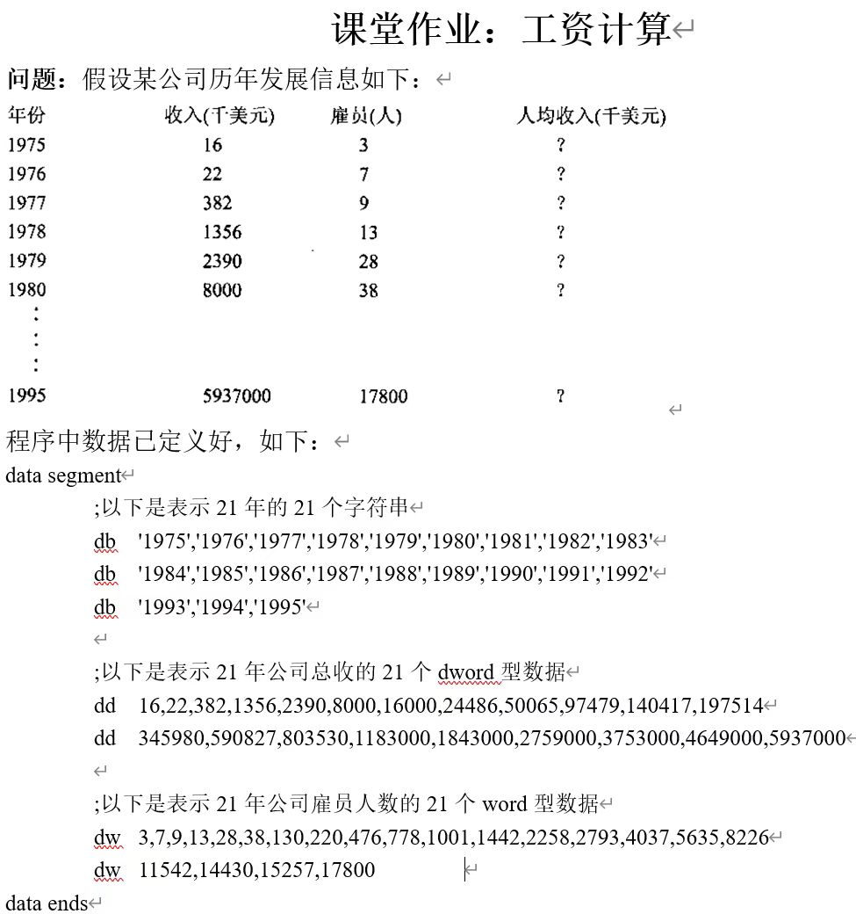
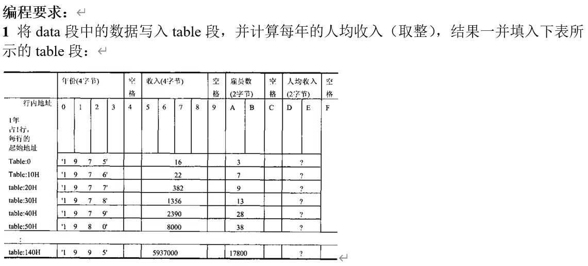
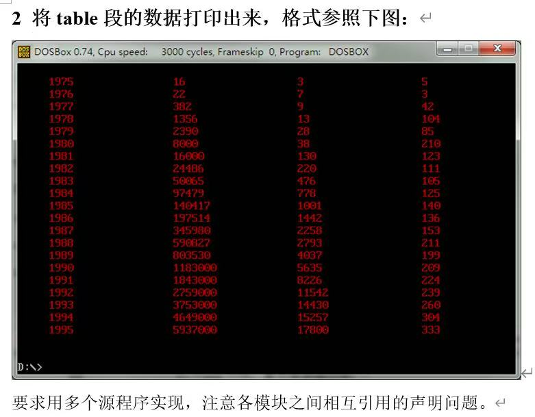
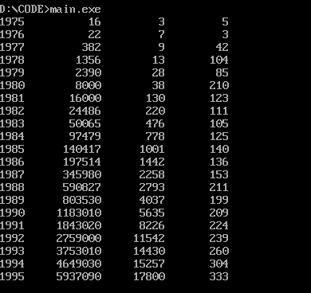

# exercise 6

## 任务要求




## 文件介绍

本项目基于 8086 汇编语言，采用多模块化设计思想实现工资计算与展示功能。为提高代码的可读性、复用性及维护效率，工程被拆分为五个核心源程序模块，各模块各司其职，通过外部符号（EXTRN/PUBLIC）进行链接交互。
源代码分别为：main.asm,build.asm,print.asm,data.asm,table.asm。

main.asm:

作为程序的启动入口，负责初始化环境（设置栈段与数据段基址），并协同调度各子模块。

build.asm：

负责table段表的构建（包括从data段迁移年份、收入、雇员数和计算人均收入）。

print.asm：

负责整张table表的打印。

data.asm：

负责数据的传入，通过集中定义原始数据（年份、收入、雇员数），将数据独立成段，增加了该程序的可迁移性和配置性。

table.asm：

负责定义和维护table表的内存布局（空间大小为21*16字节），为计算结果提供存储空间。

## 编译流程
多源程序的汇编文件编译和单文件略有区别，具体流程如下：

先将五个汇编文件分别编译，生成对应的obj目标文件

```
masm main.asm;
masm build.asm;
masm print.asm;
masm data.asm;
masm table.asm;
```
手动链接这五个obj目标文件，通过解析外部引用来生成最终的可执行文件main.exe
```
link main.obj build.obj print.obj data.obj table.obj;
```
最终运行main.exe即可得到正确的结果
```
main.exe
```
## 程序运行结果
