# fifth homework

## 一、任务内容
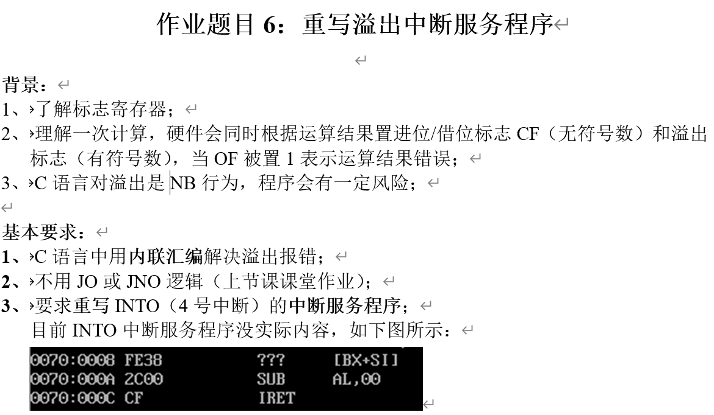
## 二、用内联汇编解决溢出报错
代码：overflow.c

核心代码如下：
```
int add_with_overflow_check(int a, int b, int *overflow)
{
    int result;
    unsigned char of;

    asm volatile (
        "addl %[b], %[a]\n\t"   // a = a + b
        "seto %[of]\n\t"        // OF → of
        : [a] "+r"(a),          // 输出：a 被修改，作为 result
          [of] "=r"(of)
        : [b] "r"(b)            // 输入：b
        : "cc"                  // 条件码被修改（OF 在这里）
    );

    result = a;
    *overflow = of;
    return result;
}
```

为避免 C 语言中“有符号整数溢出属于未定义行为”导致的检测失效，本实验不在 C 表达式中直接执行 `a+b`，而是通过 GCC 扩展内联汇编调用 CPU 的加法指令完成运算，并利用 EFLAGS 中的溢出标志 OF 判断是否发生有符号溢出。核心实现如下。

### 2.1 基本原理

在 x86 架构中，`add` 指令执行后会更新标志寄存器 EFLAGS。当把操作数按有符号数解释时，如果计算结果超出当前数据位宽可表示的范围，则 OF（Overflow Flag）被置 1。指令 `seto r/m8` 可将 OF 的值转换为 0/1 写入 8 位寄存器或内存，从而把“是否溢出”的信息保存为普通变量，便于在 C 层进行报错处理。

### 2.2 汇编模板含义

内联汇编模板包含两条指令：

- `addl %[b], %[a]`：执行 32 位加法（`l` 表示 32-bit），语义等价于 `a = a + b`。该指令由 CPU 更新 EFLAGS，并产生 OF 的最终状态。
- `seto %[of]`：将 OF 保存到变量 `of` 中。若 OF=1，则 `of=1`；否则 `of=0`。这样可在后续代码中使用 `of` 判断是否发生溢出，而不必再依赖标志位本身。

模板中的 `\n\t` 仅用于换行与缩进，便于生成的汇编代码阅读，不影响执行语义。

### 2.3 约束（operands constraints）说明

内联汇编的输出、输入与破坏描述用于告知编译器变量与寄存器的读写关系，保证正确分配寄存器并避免优化引发的错误。

- 输出操作数：
  - `[a] "+r"(a)`：`+` 表示读写操作数（read/write），`r` 表示使用寄存器。汇编执行前将 `a` 装入寄存器，执行后寄存器的新值再写回 `a`，从而得到最终和。
  - `[of] "=r"(of)`：`=` 表示只写操作数（output-only），`r` 表示使用寄存器。该变量由 `seto` 产生并写回 C 变量 `of`。
- 输入操作数：
  - `[b] "r"(b)`：`b` 仅作为输入读入，放入寄存器供 `addl` 使用，汇编不修改该变量。
- 破坏描述：
  - `"cc"`：表示该汇编块会修改条件码（condition codes），即 EFLAGS 中的标志位。由于 `addl` 会更新 OF 等标志位，并且 `seto` 依赖这些标志位，因此必须声明 `"cc"`，以防编译器在优化时错误地重排相关代码。

### 2.4 volatile 的作用

使用 `asm volatile` 的目的是禁止编译器将该汇编块视为可随意删除或重排的代码片段。由于该汇编块具有关键副作用（更新并读取 OF），`volatile` 可确保其执行顺序与存在性，提升可靠性。

### 2.5 正确性与优势

该方法的关键优势在于：加法在汇编指令中执行，溢出语义由硬件 EFLAGS 明确给出，并通过 `seto` 保存为普通变量，避免了 C 层有符号溢出可能带来的未定义行为风险。最终，C 代码仅依据 `of` 的取值输出正常结果或溢出报错信息，从而实现稳定可靠的溢出检测与处理。

### 2.6 结果演示
#### number1=100,number2=200
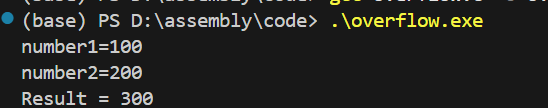
#### number1=305053005,number2=350530530
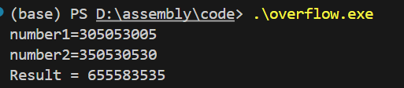
#### number1=350053053053,number2=35050330503
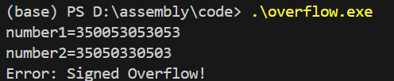
#### number1=-3053053030503,number2=-30350305030
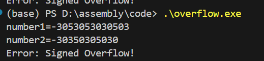
#### number1=2147483632,number2=10000
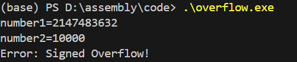
#### number1=300,number2=404040
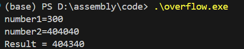


## 三、不用JO或JNO逻辑实现有符号数加法运算，发生溢出时（OF=1）能报错（数据宽度自定义，字节，字都可以）
代码：addopv2.asm
### 3.1 原理
本实验目标是在不使用 `JO/JNO` 这类“基于 OF 的条件跳转指令”的前提下，实现有符号数加法的溢出检测与报错。核心思想是：溢出由 CPU 在执行算术指令后通过 OF 标志位给出，我们只需要在 OF 被其他指令覆盖之前，采用“不依赖 JO/JNO 的方式”将该信息转换为可处理的控制流或状态。
### 3.2 OF 标志位与有符号溢出

在 x86 中执行 ADD 后，CPU 会更新标志寄存器 EFLAGS。OF（Overflow Flag）用于表示有符号运算是否溢出：当结果超出当前数据宽度可表示的有符号范围时，OF=1；否则 OF=0。
对于不同数据宽度，范围分别为：

* 8 位：-128 ～ 127

* 16 位：-32768 ～ 32767

* 32 位：-2147483648 ～ 2147483647

因此，只要能在 ADD 之后正确利用 OF，就可以可靠判断本次加法是否发生溢出。

### 3.3 INTO触发INT4
INTO（Interrupt on Overflow）指令会在 OF=1 时触发 4 号中断（INT 4），OF=0 时不产生任何效果。其执行流程为：

执行 ADD 更新 OF

执行 INTO：若 OF=1，CPU 自动触发 INT 4

由自定义的 INT 4 中断服务程序（ISR）完成报错处理（例如设置标志位或直接输出错误信息）

ISR 末尾使用 IRET 返回主程序或终止程序

该方式完全避免了 JO/JNO，同时符合“溢出即中断”的硬件语义，适用于 16 位 DOS/8086 实模式实验。
### 3.4 结果演示

输入数字要求是16位有符号数（-32768~32767）

#### first number=30000 second number=10000
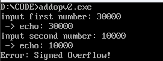
#### first number=-30000 second number=-10000
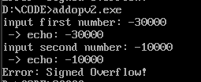
#### first number=30000 second number=10000
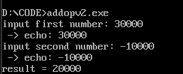
#### first number=-30000 second number=10000
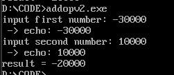
#### first number=350 second number=650
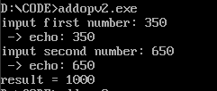
#### first number=-350 second number=-650
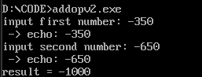

## 四、重写INTO（4号中断）的中断服务程序的部分
核心代码如下：
```
int4_isr proc far
    push ax
    push ds
    mov ax, @data
    mov ds, ax
    mov ovf_flag, 1
    pop ds
    pop ax
    iret
int4_isr endp
```
```
install_int4 proc
    push ax
    push es
    cli
    xor ax, ax
    mov es, ax
    mov word ptr es:[4*4], offset int4_isr  ; IP
    mov word ptr es:[4*4+2], cs             ; CS
    sti
    pop es
    pop ax
    ret
install_int4 endp
```
```
; 关键替换：不用 jo/jno，改用 INTO
; 若 OF=1 -> 触发 INT 4 -> ISR 把 ovf_flag 置 1
into
```

#### 4.1 设计目标

INT 4 ISR 的设计目标如下：

1. 实现溢出事件的可靠捕获：当 `ADD` 产生有符号溢出（OF=1）时，保证能够进入 ISR；
2. 不中断主流程结构：ISR 内只做最小工作，将溢出状态以变量形式记录（`ovf_flag=1`），再返回主程序统一输出报错信息；
3. 避免使用 JO/JNO：溢出检测由 `INTO + INT 4` 完成，不再通过基于 OF 的条件跳转实现。

------

#### 4.2 INT 4 向量重写（install_int4）

在 8086 实模式下，中断向量表（IVT）位于物理地址 `0000:0000`，每个中断号占用 4 字节，内容为 ISR 的入口地址（`IP` 和 `CS`）。其中 INT 4 的表项位于偏移 `4 * 4 = 16 = 0x0010`，布局如下：

- `0000:0010`：ISR 的 `IP`
- `0000:0012`：ISR 的 `CS`

程序通过 `install_int4` 将 INT 4 的向量改写为自定义 ISR 的地址，使得 `INTO` 触发 INT 4 时会跳转到本程序定义的 `int4_isr`。

```
install_int4 proc
    push ax
    push es
    cli
    xor ax, ax
    mov es, ax
    mov word ptr es:[4*4], offset int4_isr  ; IP
    mov word ptr es:[4*4+2], cs             ; CS
    sti
    pop es
    pop ax
    ret
install_int4 endp
```

其中：

- `cli/sti`：在改写向量表期间关闭/恢复中断，避免向量写入过程中被中断打断导致跳转地址不一致；
- `ES=0`：将段寄存器指向 IVT 所在的 0 段；
- 写入 `offset int4_isr` 与 `cs`：将 INT 4 的入口地址指向本程序的中断服务程序。

------

#### 4.3 INT 4 中断服务程序实现（int4_isr）

当执行 `add ax, bx` 后若发生有符号溢出，CPU 将 OF 置 1。随后执行 `into`：

- OF=1 → CPU 触发 INT 4，跳转至 IVT 中记录的入口地址（即 `int4_isr`）
- OF=0 → 不触发中断，程序继续执行

本实验 ISR 的功能是将溢出事件记录为一个全局标志 `ovf_flag=1`，随后用 `iret` 返回主程序。

```
int4_isr proc far
    push ax
    push ds
    mov ax, @data
    mov ds, ax
    mov ovf_flag, 1
    pop ds
    pop ax
    iret
int4_isr endp
```

说明如下：

- `proc far`：中断入口使用远过程形式，与中断跳转的 `CS:IP` 对应；
- `push ax / push ds`：保存 ISR 中会用到的寄存器，避免破坏主程序现场；
- `mov ds, @data`：由于进入 ISR 时 DS 的值不保证仍指向数据段，需重新建立 DS，确保能正确访问 `ovf_flag`；
- `mov ovf_flag, 1`：记录溢出事件；
- `iret`：中断返回指令，CPU 将从栈中恢复 `IP/CS/FLAGS`，返回到触发 `INTO` 后的下一条指令继续执行。

------

#### 4.4 与主程序的协同流程

主程序在执行加法后使用 `INTO` 触发溢出中断：

```
mov ovf_flag, 0
add ax, bx
into
cmp ovf_flag, 1
je  handle_overflow
```

整体流程为：

1. 运算前清零 `ovf_flag`；
2. `ADD` 更新 OF；
3. `INTO` 在 OF=1 时进入 INT 4 ISR，将 `ovf_flag` 置 1；
4. 返回后通过比较 `ovf_flag` 判断是否溢出并输出报错。

该方法实现了“使用 OF 但不使用 JO/JNO”的溢出检测，同时利用中断机制使溢出处理逻辑更加模块化。
