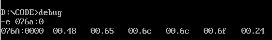

# First Homework: HelloWorld

## 一、环境配置
手动装载（mount命令）：
在`C:\Users\用户名\AppData\Local\DOSBox`中以记事本形式打开dosbox-0.74.conf，下拉到最后在`autoexec`部分的尾部写入
```
mount d d:\assembly
D:
path D:\Masm5
cd code
```
由于dosbox内的D盘是虚拟盘，所以需要将我们assmbly文件夹所在的位置挂载到它的虚拟D盘中，同时Masm5作为我们的汇编器，也要添加到环境变量路径中

## 二、helloworld
hello.asm:手写段定义版，风格严谨清晰但较为冗余，一般不常用
hello2.asm:宏模型版，采用调用过程法（main proc far,main endp）
hello3.asm:宏模型版，采用标签法（start,end start）
hello4.asm:宏模型版，采用lea，即运行时计算有效地址，区别之前的offset（段内偏移地址）
hellotzc.asm:helloworld的联系版本（独立编写）

## 三、Debug内存写入

### 1.写入数据

### 2. 写入代码

### 3. 查看寄存器默认值、修改默认cs,ds和ip


### 4. 运行代码+输出
