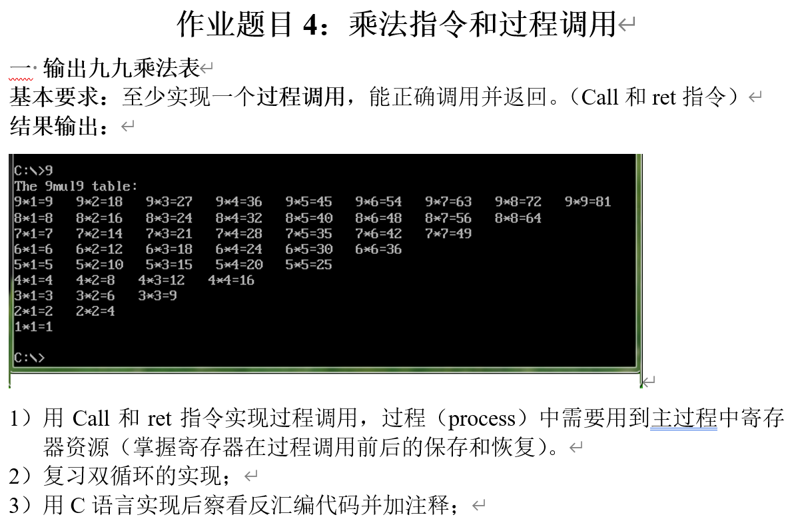
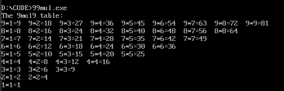
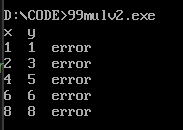

# fourth homework

任务内容

一、基本要求
代码对应99mul.asm

任务说明：输出如图所示的99乘法表

输出结果：



## 一、代码
汇编代码如下：
```
data segment
    msg db 'The 9mul9 table:', 0dh, 0ah, '$'
    space db '  $'
    equal db '*$'
    res_sym db '=$'
data ends

code segment
    assume cs:code, ds:data
start:
    mov ax, data
    mov ds, ax

    lea dx, msg
    mov ah, 09h
    int 21h

    mov cx, 9           ; 外层循环：行数 i (从9到1)
row_loop:
    push cx             ; 保存外层循环计数器
    mov bx, 1           ; 内层循环：列数 j (从1到i)
col_loop:
    ; 输出当前算式：i * j = result
    mov ax, cx
    call print_num      ; 调用过程：打印 i
    
    lea dx, equal
    mov ah, 09h
    int 21h
    
    mov ax, bx
    call print_num      ; 调用过程：打印 j
    
    lea dx, res_sym
    mov ah, 09h
    int 21h
    
    ; 计算 i * j
    mov al, cl
    mul bl              ; al = al * bl
    call print_num      ; 调用过程：打印结果
    
    lea dx, space       ; 打印空格分隔
    mov ah, 09h
    int 21h

    inc bx              ; j++
    mov al, cl
    cmp bl, al          ; 判断 j 是否超过 i
    jbe col_loop

    ; 换行
    mov dl, 0dh
    mov ah, 02h
    int 21h
    mov dl, 0ah
    int 21h

    pop cx              ; 恢复外层循环计数器
    loop row_loop

    mov ax, 4c00h
    int 21h

; --- 子程序：打印寄存器 AX 中的数字 ---
print_num proc
    push ax
    push bx
    push cx
    push dx

    mov bx, 10
    xor cx, cx
split:
    xor dx, dx
    div bx
    push dx
    inc cx
    test ax, ax
    jnz split
show:
    pop dx
    add dl, '0'
    mov ah, 02h
    int 21h
    loop show

    pop dx
    pop cx
    pop bx
    pop ax
    ret                 ; 返回主程序
print_num endp

code ends
end start
```
## 二、 过程调用（Procedure Call）的原理

在本程序中，核心功能被封装在 `print_num proc` 子程序中。其运行涉及 `call` 和 `ret` 两个核心指令：

### 1. `call` 指令的动作

当主程序执行 `call print_num` 时，CPU 执行以下操作：

- 保存返回地址：自动将当前 `call` 指令的下一条指令地址压入栈（Stack）中。
- 控制权转移：将程序的执行流跳转到 `print_num` 的起始地址。

### 2. `ret` 指令的动作

当子程序末尾执行 `ret` 时：

- 恢复返回地址：从栈顶弹出之前保存的地址。
- 返回主程序：CPU 跳转回该地址，主程序从 `call` 的下一行继续执行。

------

## 三、 寄存器在调用前后的保存与恢复

由于 `print_num` 需要进行除法运算和循环显示，它必须修改寄存器的值。为了不破坏主程序（正在进行乘法表循环）的环境，程序采用了 **“被调用者保存现场”** 的策略。

### 1. 保存现场（子程序入口处）

Code snippet

```
print_num proc
    push ax    ; 备份主程序当前的 AX (可能是乘法结果)
    push bx    ; 备份主程序当前的 BX (当前的列数 j)
    push cx    ; 备份主程序当前的 CX (当前的行数 i)
    push dx    ; 备份主程序当前的 DX (可能正在使用的指针)
```

**原理**：在进入子程序功能逻辑之前，将主程序正在使用的所有重要寄存器值压入栈中。此时，这些寄存器在物理上可以被子程序自由修改，但它们的“原件”安全地存在内存栈区。

### 2. 恢复现场（子程序出口处）

Code snippet

```
    pop dx     ; 按相反顺序恢复 DX
    pop cx     ; 恢复 CX (确保主程序取回正确的行号)
    pop bx     ; 恢复 BX (确保主程序取回正确的列数)
    pop ax     ; 恢复 AX
    ret        ; 返回主程序
print_num endp
```

**原理**：子程序任务完成后，通过 `pop` 指令将备份值从栈中取回。根据栈 **“先进后出（LIFO）”** 的特性，弹出的顺序必须与压入的顺序完全相反。

------

## 四、 本程序中的冲突处理实例

在九九乘法表中，寄存器冲突最为激烈：

- **主程序**：使用 `CX` 控制行循环（9到1），使用 `BX` 控制列循环（1到i）。
- **子程序 (`print_num`)**：也需要使用 `BX`（作为除数10）和 `CX`（作为显示位数的计数器）。

**如果没有保存与恢复机制：** 子程序运行一次后，`CX` 会变成 0，`BX` 会变成 10。当回到主程序执行 `loop row_loop` 时，循环会因为 `CX` 归零而提前终止，或者因为 `BX` 错误导致列数计算乱套。

**通过 `push/pop` 机制：** 主程序感觉不到寄存器被动过，从而保证了双重循环能准确地从 9x9 运行到 1x1。

## 五、反汇编代码
反汇编代码如下：
```
15	int main() {
   0x00007ff60fc015b2 <+0>:	push   rbp
   0x00007ff60fc015b3 <+1>:	mov    rbp,rsp
   0x00007ff60fc015b6 <+4>:	sub    rsp,0x30
   0x00007ff60fc015ba <+8>:	call   0x7ff60fc01700 <__main>

16	    printf("The 9mul9 table:\n");
   0x00007ff60fc015bf <+13>:	lea    rcx,[rip+0x11a3d]        # 0x7ff60fc13003
   0x00007ff60fc015c6 <+20>:	call   0x7ff60fc01540 <printf>

17	
18	    // 外层循环：对应 row_loop (使用 cx 控制)
19	    for (int i = 9; i >= 1; i--) {
   0x00007ff60fc015cb <+25>:	mov    DWORD PTR [rbp-0x4],0x9
   0x00007ff60fc015d2 <+32>:	jmp    0x7ff60fc0163f <main+141>
   0x00007ff60fc0163b <+137>:	sub    DWORD PTR [rbp-0x4],0x1
   0x00007ff60fc0163f <+141>:	cmp    DWORD PTR [rbp-0x4],0x0
   0x00007ff60fc01643 <+145>:	jg     0x7ff60fc015d4 <main+34>

20	        
21	        // 内层循环：对应 col_loop (使用 bx 从 1 增加到 i)
22	        for (int j = 1; j <= i; j++) {
   0x00007ff60fc015d4 <+34>:	mov    DWORD PTR [rbp-0x8],0x1
   0x00007ff60fc015db <+41>:	jmp    0x7ff60fc01627 <main+117>
   0x00007ff60fc01623 <+113>:	add    DWORD PTR [rbp-0x8],0x1
   0x00007ff60fc01627 <+117>:	mov    eax,DWORD PTR [rbp-0x8]
   0x00007ff60fc0162a <+120>:	cmp    eax,DWORD PTR [rbp-0x4]
   0x00007ff60fc0162d <+123>:	jle    0x7ff60fc015dd <main+43>

23	            
24	            // 1. 打印被乘数 (i)
25	            print_num(i);
   0x00007ff60fc015dd <+43>:	mov    eax,DWORD PTR [rbp-0x4]
   0x00007ff60fc015e0 <+46>:	mov    ecx,eax
   0x00007ff60fc015e2 <+48>:	call   0x7ff60fc01591 <print_num>

26	            
27	            // 2. 打印乘号 (*)
28	            printf("*");
   0x00007ff60fc015e7 <+53>:	lea    rcx,[rip+0x11a27]        # 0x7ff60fc13015
   0x00007ff60fc015ee <+60>:	call   0x7ff60fc01540 <printf>

29	            
30	            // 3. 打印乘数 (j)
31	            print_num(j);
   0x00007ff60fc015f3 <+65>:	mov    eax,DWORD PTR [rbp-0x8]
   0x00007ff60fc015f6 <+68>:	mov    ecx,eax
   0x00007ff60fc015f8 <+70>:	call   0x7ff60fc01591 <print_num>

32	            
33	            // 4. 打印等号 (=)
34	            printf("=");
   0x00007ff60fc015fd <+75>:	lea    rcx,[rip+0x11a13]        # 0x7ff60fc13017
   0x00007ff60fc01604 <+82>:	call   0x7ff60fc01540 <printf>

35	            
36	            // 5. 计算并打印结果 (i * j)
37	            // 对应汇编中的 mul bl
38	            print_num(i * j);
   0x00007ff60fc01609 <+87>:	mov    eax,DWORD PTR [rbp-0x4]
   0x00007ff60fc0160c <+90>:	imul   eax,DWORD PTR [rbp-0x8]
   0x00007ff60fc01610 <+94>:	mov    ecx,eax
   0x00007ff60fc01612 <+96>:	call   0x7ff60fc01591 <print_num>

39	            
40	            // 6. 打印间隔空格
41	            printf("  ");
   0x00007ff60fc01617 <+101>:	lea    rcx,[rip+0x119fb]        # 0x7ff60fc13019
   0x00007ff60fc0161e <+108>:	call   0x7ff60fc01540 <printf>

42	        }
43	        
44	        // 每一行结束换行：对应汇编中的 0dh, 0ah
45	        printf("\n");
   0x00007ff60fc0162f <+125>:	lea    rcx,[rip+0x119e6]        # 0x7ff60fc1301c
   0x00007ff60fc01636 <+132>:	call   0x7ff60fc01540 <printf>

46	    }
47	
48	    return 0;
   0x00007ff60fc01645 <+147>:	mov    eax,0x0

49	}
=> 0x00007ff60fc0164a <+152>:	add    rsp,0x30
   0x00007ff60fc0164e <+156>:	pop    rbp
   0x00007ff60fc0164f <+157>:	ret   
```

### 1. 函数序言：建立栈帧

```
15  int main() {
   0x00007ff60fc015b2 <+0>: push   rbp          ; 备份调用者的栈基址寄存器 (保护现场)
   0x00007ff60fc015b3 <+1>: mov    rbp,rsp      ; 设置当前函数的栈基址
   0x00007ff60fc015b6 <+4>: sub    rsp,0x30     ; 在栈上开辟 48 字节空间 (用于存放局部变量 i, j 和备份寄存器)
   0x00007ff60fc015ba <+8>: call   0x7ff60fc01700 <__main> ; 初始化运行库
```

### 2. 外层循环逻辑 (i = 9; i >= 1; i--)


```
19      for (int i = 9; i >= 1; i--) {
   ; 初始化 i = 9
   0x00007ff60fc015cb <+25>:    mov    DWORD PTR [rbp-0x4],0x9  ; 将局部变量 i 存入内存 [rbp-4]
   0x00007ff60fc015d2 <+32>:    jmp    0x7ff60fc0163f           ; 跳转到循环条件判断处

   ; 循环步进：i--
   0x00007ff60fc0163b <+137>:   sub    DWORD PTR [rbp-0x4],0x1  ; i = i - 1

   ; 循环条件判断：i > 0
   0x00007ff60fc0163f <+141>:   cmp    DWORD PTR [rbp-0x4],0x0  ; 比较 i 与 0
   0x00007ff60fc01643 <+145>:   jg     0x7ff60fc015d4           ; 如果 i > 0，进入内层循环
```

### 3. 内层循环逻辑 (j = 1; j <= i; j++)

```
22          for (int j = 1; j <= i; j++) {
   ; 初始化 j = 1
   0x00007ff60fc015d4 <+34>:    mov    DWORD PTR [rbp-0x8],0x1  ; 将局部变量 j 存入内存 [rbp-8]
   0x00007ff60fc015db <+41>:    jmp    0x7ff60fc01627           ; 跳转到内层条件判断处

   ; 循环步进：j++
   0x00007ff60fc01623 <+113>:   add    DWORD PTR [rbp-0x8],0x1  ; j = j + 1

   ; 内层条件判断：j <= i
   0x00007ff60fc01627 <+117>:   mov    eax,DWORD PTR [rbp-0x8]  ; 取出 j
   0x00007ff60fc0162a <+120>:   cmp    eax,DWORD PTR [rbp-0x4]  ; 比较 j 与 i
   0x00007ff60fc0162d <+123>:   jle    0x7ff60fc015dd           ; 如果 j <= i，执行打印算式
```

### 4. 算式打印与函数调用


```
25              print_num(i);
   0x00007ff60fc015dd <+43>:    mov    eax,DWORD PTR [rbp-0x4]  ; 取出 i
   0x00007ff60fc015e0 <+46>:    mov    ecx,eax                  ; 将 i 放入第1个参数寄存器 ECX
   0x00007ff60fc015e2 <+48>:    call   0x7ff60fc01591           ; 调用子程序

31              print_num(j);
   0x00007ff60fc015f3 <+65>:    mov    eax,DWORD PTR [rbp-0x8]  ; 取出 j
   0x00007ff60fc015f6 <+68>:    mov    ecx,eax                  ; 将 j 放入 ECX
   0x00007ff60fc015f8 <+70>:    call   0x7ff60fc01591           ; 调用子程序

38              print_num(i * j);
   0x00007ff60fc01609 <+87>:    mov    eax,DWORD PTR [rbp-0x4]  ; 取出 i
   0x00007ff60fc0160c <+90>:    imul   eax,DWORD PTR [rbp-0x8]  ; 有符号乘法：EAX = i * j
   0x00007ff60fc01610 <+94>:    mov    ecx,eax                  ; 结果放入 ECX 传参
   0x00007ff60fc01612 <+96>:    call   0x7ff60fc01591           ; 调用子程序
```

### 5. 函数结语：清理并返回

```
48      return 0;
   0x00007ff60fc01645 <+147>:   mov    eax,0x0      ; 将返回值 0 放入 EAX (C 语言惯例)

49  }
   0x00007ff60fc0164a <+152>:   add    rsp,0x30     ; 释放栈空间 (销毁局部变量)
   0x00007ff60fc0164e <+156>:   pop    rbp          ; 恢复调用者的栈基址
   0x00007ff60fc0164f <+157>:   ret                 ; 弹出返回地址，回到上层函数
```

## 六、99乘法表纠错

### 代码
代码对应99mulv2.asm

### 结果显示


纠错机制：程序通过 mul bl（实时计算）获取结果，并使用 cmp ax, dx 将其与 .data 段中预定义的 table（静态答案表）进行比对。

异常触发：一旦发现不匹配，立即通过 jne output_err 跳转到错误处理模块，输出当前发生错误的坐标（乘数与被乘数）。