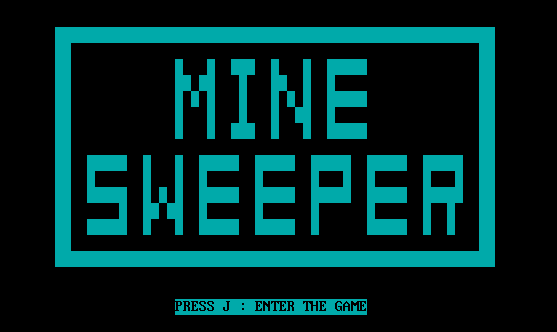
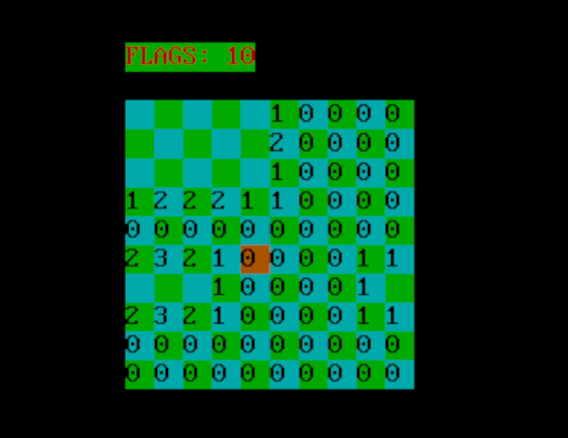
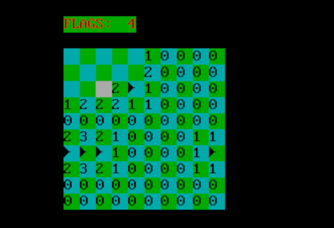
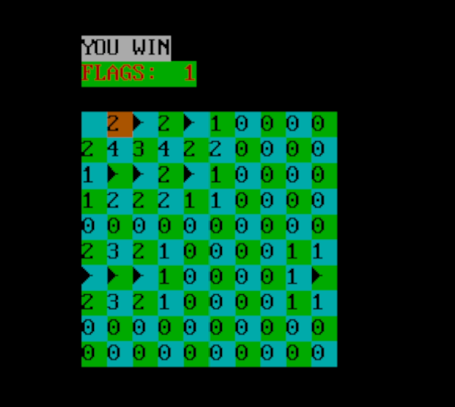
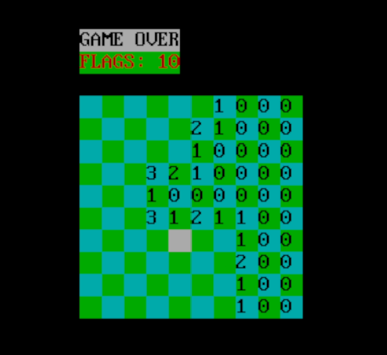

# Winmine

[toc]

## 项目概述

本项目是一个基于 x86 汇编语言（MASM）开发的经典策略益智游戏——扫雷（Winmine）。游戏的目标是控制光标在 10×10 的雷区中进行探索，利用数字提示逻辑推理出地雷位置，最终避开所有地雷并挖开剩余的 90 个安全区域以获得胜利。游戏采用了 DOS 文本模式下的直接显存读写技术，实现了流畅的光标高亮与界面刷新，玩家可以通过键盘（WASD）控制移动，并使用特定按键进行挖掘(J)和插旗标记(K)。

## 项目展示
游戏UI：

游戏过程：


游戏胜利：

游戏失败：


具体的游戏演示：demo演示.mp4
可执行文件：winmine.exe
代码文件：winmine.asm
## 项目功能介绍

本项目主要包含以下五大核心功能模块：

### 图形界面与交互系统 

- *视化游戏网格：并在屏幕中央绘制 $10 \times 10$ 的游戏雷区，利用 ASCII 字符构建网格边界，界面整洁直观。
- 光标实时渲染：
  - 实现了基于键盘（WASD）的光标移动控制。
  - 动态高亮：光标移动时，程序直接修改显存属性字节，实时改变当前选中格子的背景色（高亮），提供清晰的视觉反馈。
- 状态栏显示：游戏界面包含标题 "MINESWEEPER" 及周边装饰，模拟了经典的游戏机界面风格。

### 智能地图生成系统

- 硬件级随机数：通过读取 8253 可编程间隔定时器（端口 43H/40H）的计数值生成随机种子，确保每次开局雷区分布的不可预测性。
- 人性化“首发保护”机制：
  - 游戏初始化时不立即布雷，而是等待玩家按下第一次挖掘键后才开始生成。
  - 生成算法会自动避开玩家当前点击的坐标及其周围 8 个邻居，确保“第一下绝对安全”且大概率能挖开一片空地，极大提升了用户体验。
- 雷数预计算：采用高效的遍历算法，在布雷完成后，立即计算并填入所有非雷格子周围的地雷数量。

### 核心游戏逻辑

- 挖掘与插旗：
  - 挖掘 (J键)：翻开当前格子。如果是数字则显示数字；如果是雷则判负；如果是空地则触发递归。
  - 插旗 (K键)：在疑似有雷的格子上进行标记（显示旗帜图标），防止误触，并辅助玩家推理。
- 递归连锁展开：
  - 实现了深度优先搜索 (DFS) 算法。当玩家挖开一个“空白格”（周围无雷）时，程序会自动递归检测并挖开其周围的 8 个格子，并持续扩散，直到遇到数字边界。这一功能实现了“点一下开一片”的爽快体验。

### 胜负判定与反馈

- 实时裁判系统：
  - 胜利判定：每次操作后，程序会自动扫描内存中的 `explored` 数组。当且仅当所有 90 个非雷格子均被标记为“已探索”时，判定玩家胜利。
  - 失败判定：一旦挖到地雷（内存值为 77），立即中断游戏。
- 终局特效：
  - 视觉：直接操作显存，在屏幕中央覆盖显示闪烁的"YOU WIN"（白底黑字）或 "GAME OVER" 字样。
  - 听觉：调用系统扬声器播放特定的胜利或失败音效。

### 系统控制

- 即时退出：在游戏任意时刻按下 'X' 键，可利用 DOS 中断 `4C00H` 安全退出程序并返回操作系统。
- 边界保护：在光标移动、递归扩散逻辑中均加入了严格的边界检查，防止程序读写越界导致死机或显示乱码。

## 项目开发流程

### 开发环境

本项目基于 x86 架构的实模式汇编开发，主要运行环境及工具如下：

- 操作系统环境：Windows 11 下运行 DOSBox 0.74 模拟器（模拟纯 DOS 环境）。
- 汇编编译器：MASM 5.0 (Microsoft Macro Assembler) 。用于将 `.asm` 源码编译为 `.obj` 目标文件。
- 链接器：LINK.EXE。用于将 `.obj` 文件链接为可执行的 `.EXE` 文件。
- 调试工具：Debug.exe。
- 代码编辑器：VS Code (配合 MASM 插件) ，用于编写源代码。

### 项目结构

本项目采用经典的段式结构，将数据、堆栈和代码逻辑分离，清晰管理内存。

- 数据段 (Data Segment)：
  - 模型数据：
    - `mine_filed`：存放地雷分布及周围数字的逻辑地图。
    - `explored`：记录方块是否被挖开的状态表。
    - `flags_filed`：记录旗帜插放位置的标记表。
    - `position`：记录当前光标的逻辑坐标 (Row, Col)。
  - 资源数据：
    - `background`：存放界面配色方案。
    - `mov_freq` / `mov_time`：存放音效的频率与时长数据。
    - `str_flags` / `lose_str` / `win_str`：存放 UI 文本字符串。
- 堆栈段 (Stack Segment)：
  - 定义了足够的栈空间 (`dw 10 dup(0)`)，用于支持子程序调用 (`CALL/RET`) 和深度递归 (`RECURSION`) 时的现场保护。
- 代码段 (Code Segment)：
  - 主程序 (Main)：负责初始化段寄存器、调用开场界面、进入游戏主循环。
  - 视图模块 (View)：`SCREEN` (绘制界面), `vline/hline` (画线), `RE_COLOR/CH_COLOR` (光标渲染)。
  - 控制模块 (Controller)：`CONTROL` (键盘监听), `MINES_GENERATE` (布雷逻辑), `CHECK_PROC` (胜负判定)。
  - 核心算法 (Algorithm)：`SET_NUM` (计算雷数), `RECURSION` (空白区递归展开)。

### 开发步骤 (Development Steps)

本项目遵循“自底向上”与“模块化”相结合的开发策略，具体步骤如下：

第一阶段：基础设施搭建与界面绘制

1. 框架搭建：编写 `start` 入口，初始化 `DS`, `ES`, `SS` 寄存器，确保程序能正确编译运行并退出。
2. 显存接管：实现直接写显存逻辑 (`MOV AX, 0B800H`)。
3. UI 绘制：编写 `SCREEN` 子程序，利用循环和地址偏移计算，在屏幕上画出网格线、边框以及 "MINESWEEPER" 标题。
   - 难点攻克：实现了 `vline` 和 `hline` 通用画线函数。

第二阶段：交互逻辑与光标控制**

1. 键盘监听：编写 `CONTROL` 过程，利用 `INT 21H` 接收 WASD 键值。
2. 光标移动：实现光标的逻辑坐标 (`position`) 更新，并同步映射到物理显存地址。
3. 视觉反馈：实现“移动即重绘”——光标移走时恢复背景色 (`RE_COLOR`)，移入新位置时高亮显示 (`CH_COLOR`)。

第三阶段：核心游戏逻辑实现

1. 随机布雷：编写 `RAND` 函数（读取 8253 计数器），实现 `MINES_GENERATE`。
   - 关键特性：加入了“首发保护”逻辑，确保第一次点击不生成雷。
2. 数字计算：实现 `SET_NUM` 算法，遍历生成的雷点，对其周围 8 个邻居进行数值累加。
3. 状态管理：实现挖开 (`SET_EXPLORED`) 和 插旗 (`SET_FLAG`) 的逻辑，同步更新 `explored` 和 `flags_filed` 数组。

第四阶段：高级算法与完备性

1. 递归展开：这是项目最核心的难点。编写 `RECURSION` 函数，当挖到 ‘0’ 时，自动向 8 个方向递归调用，实现连片开图效果。
   - 调试重点：解决了递归过程中的寄存器保护 (`PUSH/POP`) 和边界溢出问题。
2. 胜负判定：编写 `CHECK_PROC` 实时统计已探索格数，达到 90 格即判胜。
3. 音效与结束：添加 `MUSIC` 模块，利用 8253 发声，并制作 `GAME_OVER` 和 `YOU_WIN` 的闪烁文字特效。

第五阶段：测试与优化

1. 边界测试：在地图边缘、角落进行移动和挖雷测试，修复越界 Bug。
2. 逻辑验证：反复测试“首发保护”是否生效，验证雷数计算是否准确。
3. 代码重构：将重复的坐标计算代码封装为子程序，优化代码体积。

## 项目代码解释
### 初始游戏界面显示：
1. 绘制大型方框
由于显存是由`字符、颜色、字符、颜色排列的`，因此我们可以对需要绘制的横线上的每个格子，每次指向他们的颜色节点，对其上色（代码中使用的是0011000B，蓝底黑字），之后只要通过循环+2即可绘制一条线，四条线合在一起即为一个大型方框。
代码示意图如下所示：
```
;方框
mov bx,665
line1:
mov es:[bx],al
add bx,2
cmp bx,773
jbe line1
```
2. 绘制字母
容易发现任何一个字母都可以表现为若干个点+横线+竖线的形式，因此本项目先定义了绘制竖线的函数，又定义了绘制横线的函数，最后通过针对不同字母，绘制若干个点+横向+竖线的组合，完成了对字母的绘制
绘制字母M例子如下所示：
```
;字母M
mov bx,1015
call vline
mov bx,1023
call vline
mov bx,1177
mov es:[bx],al
add bx,4
mov es:[bx],al
add bx,160
sub bx,2
mov es:[bx],al
```
vline为绘制横线的函数，其他的mov es:[bx],al均表示绘制像素点
绘制字母E的例子如下所示：
```
;字母E
mov bx,1053
call vline
mov bx,1055
call hline
mov bx,1375
call hline
mov bx,1695
call hline
```
hline为绘制竖线的函数
提示语句显示`PRESS J : ENTER THE GAME`对应代码如下：
```
;闪烁指示文字
mov bx,3414
mov si,0
mov cx,24
mov ah,00110000B
set_key_flag:
mov al,key_flags[si]
mov es:[bx],ax
add bx,2
inc si
loop set_key_flag
```
先设置ah为提示语句颜色，每次从key_flags(数据段中对应提示语句字符串)读取第SI个字符到al，然后将字符AL和颜色AH写入显存ES:[BX]中，再讲显存往后移动2字节，指向下一个屏幕格子。
3. 按J后清屏逻辑
只需按之前的逻辑，遍历屏幕内的所有格子，并将颜色改为黑色即可

### 扫雷移动显示：
1. 恢复颜色/取消高亮

一个格子占两个像素点
```
AND BYTE PTR ES:[BX],00111111B;恢复颜色
AND BYTE PTR ES:[BX+2],00111111B;恢复颜色
```
2. 标记旗子（认为某个位置是雷）
```
MOV AX,explored
MOV DS,AX
MOV BL,20
MOV AL,position[0]
MUL BL
MOV BX,AX
ADD BL,position[1]
CMP BYTE PTR DS:[BX],1
JE SET_ENDS
```
explored数组记录地图上哪些格子已经被翻开，1表示已翻开，0表示未翻开，只有为翻开的才可以标记,position[0]代表当前横坐标，position[1]代表当前纵坐标
```
; --- 计算显存地址 (放入 BX) ---
MOV BX,1660         ; 游戏区域在屏幕上的起始偏移量
MOV SI,0            ; 清空 SI
MOV DH,160          ; 屏幕一行 160 字节
MOV DL,2            ; 一个字符 2 字节
; 算行偏移: Row * 160
MOV AL,CH           ; CH 是当前行号
MUL DH
ADD BX,AX
; 算列偏移: Col * 2
MOV AL,CL           ; CL 是当前列号
MUL DL
ADD BX,AX           ; 此时 BX 指向屏幕上该格子的位置
```
以上代码是计算屏幕显存的地址，即物理地址
```
; --- 计算逻辑地址 (放入 SI) ---
MOV DH,20           ; 逻辑数组一行 20 字节
; 算行偏移
MOV AL,position[0]  ; 取行坐标
MUL DH
MOV SI,AX
; 算列偏移
MOV AL,position[1]  ; 取列坐标
MUL DL              ; 同样乘以2 (因为逻辑数组也是字对齐或稀疏存储)
ADD SI,AX           ; 此时 SI 指向 flags_filed 数组中的位置
```
以上代码是计算逻辑地址，即在内存数组中的地址
当我们进行标记旗子或者取消标记旗子操作时，我们即需要在屏幕上做出显示处理，也需要在逻辑数组中，进行旗子在对应格子的标记（可以理解成flag[i][j]=1）
若要拔旗：
```
INC num_flags[0]    ; 剩余旗帜数 +1 (回收旗帜)
MOV BYTE PTR DS:[SI],0H ; 逻辑数组清零 (标记为无旗)

; 清除屏幕上的旗帜图标
MOV BYTE PTR ES:[BX],00000000B ; 字符写 0 (空)
MOV BYTE PTR ES:[BX+2],00000000B ; (这里可能为了清除彻底写了两个字节)

JMP SET_ENDS        ; 跳过插旗部分，直接去更新UI
```
若要插旗
```
SET_F:  
    MOV AL,0
    CMP num_flags[0],AL ; 检查剩余旗帜数是否为 0
    JE SET_ENDS         ; 如果没旗子了，不能插，直接结束

    DEC num_flags[0]    ; 剩余旗帜数 -1
    MOV BYTE PTR DS:[SI],01H ; 逻辑数组置 1 (标记为有旗)
    MOV BYTE PTR ES:[BX],16  ; 在屏幕上画出 ASCII 16 (► 实心箭头，代表旗帜)
```
最后，更新上方的UI数字（还剩多少旗子）：
```
SET_ENDS:
    MOV AL,10
    MOV BX,1354         ; 数字在屏幕上的显存地址
    CMP num_flags[0],AL ; 检查是否是 10 (两位数)
    JNE SINGLE_DIGIT    ; 如果不是10 (是 0-9)，跳转处理个位数

    ; 处理 "10"
    MOV AL,49           ; '1' 的 ASCII
    MOV AH,00100100B    ; 颜色属性
    MOV ES:[BX],AX      ; 显示 '1'
    MOV AL,48           ; '0' 的 ASCII
    MOV ES:[BX+2],AX    ; 显示 '0'
    JMP OVER_SET_FLAGS

SINGLE_DIGIT: 
    ; 处理 " 9" 到 " 0"
    MOV AL,num_flags[0]
    ADD AL,48           ; 数字转 ASCII (0 -> '0')
    MOV AH,00100100B    ; 颜色
    MOV ES:[BX+2],AX    ; 在个位显示数字
    MOV AL,32           ; 空格 ASCII
    MOV ES:[BX],AX      ; 十位显示空格 (把原来的 '1' 擦掉)
```
### 检测胜利条件
每次遍历地图内的100个格子，检查当前格子状态是否为'1'，如果为1则计数，最后检查总数是否达到90即可。
### 键盘移动操控（W、A、S、D、J、K）
1. 移动操作（以UP为例）
```
UP: 
    CMP CH,0            ; 1. 边界检查：如果在第0行
    JE END_INPUT_TRANSFER ; 无法再向上，直接放弃操作

    CALL RE_COLOR       ; 2. 恢复颜色：把当前光标所在的格子恢复成普通颜色

    DEC CH              ; 3. 更新坐标：行号减 1
    MOV position[0],CH  ; 保存回内存变量

    JMP CH_COLOR        ; 4. 跳转去高亮新位置
```
2. 高亮新位置
```
CH_COLOR: 
    MOV BX,1661         ; 显存基准地址 (颜色属性位)
    
    ; --- 计算垂直偏移 (行 * 160) ---
    MOV AL,position[0]
    MOV DL,160
    MUL DL
    ADD BX,AX

    ; --- 计算水平偏移 ---
    ; 注意：这里有一个计算细节
    MOV AL,position[1]  ; 取列坐标 (例如 0, 2, 4...)
    MOV DH,2            
    MUL DH              ; 再次乘以 2？ (结果变成 0, 4, 8...)
    ADD BX,AX           ; 加上偏移
    
    ; --- 应用高亮颜色 ---
    ; 11000000B 通常表示背景高亮或闪烁
    OR BYTE PTR ES:[BX],11000000B   ; 修改左半边属性
    OR BYTE PTR ES:[BX+2],11000000B ; 修改右半边属性 (因为一个格子占两个字符宽)
    JMP END_INPUT
```
由于一行的字节为160，所以DL作为乘法因子来在屏幕上进行快速定位，其他的逻辑和之前一样。

### 第一次点击的特殊判定
```
FIRST_J:
    ; --- 第一次点击的特殊处理 ---
    ; 1. 记录第一次点击的坐标 (为了防止布雷时把雷布在这里)
    MOV AL,position[0]
    MOV BYTE PTR FIRST_COORDINATE[0],AL
    MOV AL,position[1]
    MOV BYTE PTR FIRST_COORDINATE[1],AL
    
    ; 2. 先设置周围环境 
    CALL SET_AROUND
    
    ; 3. 现在才开始生成地雷！
    ; 这样布雷算法就可以避开玩家刚才点击的那个坐标，保证第一下必定安全。
    CALL MINES_GENERATE
    
    ; 4. 标记不再是第一步
    MOV AL,0
    MOV FIRST[0],AL
    
    ; (这里应该还需要继续执行挖开操作，或者 MINES_GENERATE 内部处理了)
```
通过position数组记录当前坐标并生成全部地图的地雷，以防第一次点击就碰到地雷
### 预处理函数
1. SET_AROUND
作用：计算周围的8个邻居，以如下代码为例
```
MOV DH,position[0]
MOV DL,position[1]
DEC DH
SUB DL,2
MOV AROUND_X[0],DH
MOV AROUND_Y[0],DL
```
以当前位置DH:+1/-1代表上移下移，DL:+2/-2代表左移右移，通过around_x和around_y数组来对周围的8个格子进行标记
2. RNAD
随机数生成函数
实现原理：通过读取主板上的8253可编程间隔定时器芯片来获取随机数
具体代码如下：
```
first_way:
MOV AL,1
MOV change_flag[0],AL   ; 标记当前用的是方法1
; --- 核心随机逻辑 ---
MOV AX,0
OUT 43H, AL             ; 向控制端口 43H 写 0。
                        ; 这是一条“锁存命令”，告诉芯片：“把你内部计数器0的当前数值定住，我要读。”
IN AL, 40H              ; 从数据端口 40H 读取计数器的低 8 位。
                        ; 这个计数器每秒跳变约 119万次，所以读取到的数值非常随机。
; --- 取余数算法 (模运算) ---
MOV DL,10               ; 除数设为 10
DIV DL                  ; 做除法：AX / 10
                        ; 结果：商在 AL，余数在 AH
MOV BL,AH               ; 【关键】把余数 (0-9) 存入 BL
JMP pops                ; 跳去结束
```
通过IN操作读取数据端口中计数器的低8位，取其十进制下的最后一位作为随机数
### 挖开格子的核心逻辑
先计算出当前光标对应的内存数组地址（逻辑地址）
1. 标记状态
   切换到explored数据段并将该位置记为1
2. 检查地雷
   切换到mine_filed数据段,检查该位置是否有雷，如果不是雷则显示数字，否则游戏结束
3. 显示数字
   若没踩雷，程序需要把格子周围的地雷数量显示在屏幕上
### 核心功能：连锁自动挖开
当玩家挖开一个雷，若这个格子周围无雷，游戏会自动的把周围一圈也挖开，如果被挖开的格子周围也全是0，那么它会继续扩散，直到遇到数字边界或者不全是0为止
实现思路：采用递归的方法
1. 尝试向8个方向尝试挖开（以DIR1：左上角挖开为例）
```
DIR1: 
    PUSH DX             ; 【关键】保存当前中心点的坐标！
                        ; 因为递归会修改 DX，如果不存，回来就找不到原始位置了。
    ; --- 1. 边界检查 ---
    CMP DH,0            ; 已经在第 0 行了吗？
    JE END_DR1          ; 是，不能再往上走，退出。
    CMP DL,0            ; 已经在第 0 列了吗？
    JE END_DR1          ; 是，不能再往左走，退出。
    ; --- 2. 移动坐标 ---
    DEC DH              ; 向上 (Row - 1)
    SUB DL,2            ; 向左 (Col - 2，注意步长是2)
    ; --- 3. 状态检查 ---
    CALL IS_EXPLORED    ; (辅助函数) 检查这个新格子是否已经挖开过？
    CMP AL,0            ; AL=0 表示未探索
    JNE END_DR1         ; 如果已经挖开了，跳过 (防止死循环)。
    ; --- 4. 执行挖开动作 ---
    CALL SET_EX         ; (辅助函数) 把它标记为已探索，并在屏幕上画出来。
    ; --- 5. 判断是否继续深入 (递归核心) ---
    MOV AX,mine_filed
    MOV DS,AX
    MOV CL,DS:[BX]      ; 获取这个新格子的数值 (是雷、数字、还是0?)
    CMP CL,0            ; 它是空白格(0)吗？
    JNE END_DR1         ; 如果它是数字(1-8)，到此为止，不继续扩散。
    CALL RECURSION      ; 【递归调用】它是0！以它为中心，继续向它的周围8个方向扩散！
END_DR1:
    POP DX              ; 【关键】恢复原来中心点的坐标，以便接着执行 DIR2。
    RET
```
先判断是否在边界，如果不在边界，寻找左上角的点，若已经探索，则不重复递归，若还未探索，则挖开它，同时检查：
如果数字依旧是0：向其他8个方向扩散
如果数字不为0：到此为止，不继续扩散
### IS_EXPLORED函数
作用：检查该格子是否已经探索
```
IS_EXPLORED:
MOV CH,DH
MOV AL,20
MUL CH
MOV BH,0
MOV BL,DL
ADD BX,AX
MOV AX,explored
MOV DS,AX
MOV AL,1
MOV AH,DS:[BX]
CMP AH,AL
JE END_IS_EXPLORED
MOV AL,0
END_IS_EXPLORED:
RET
```
依然是通过计算内存（假设内存为20*20），先计算行，再计算列，从而算出改个字在逻辑内存中的具体位置，然后对比explored数据段中的数字
如果为1，则跳转结束；否则将返回值AL置为0.
### SET_EX函数
作用：将目前该块设置为已探索并显示
实现原理：先计算偏移量（同上），在explored数据段中对应位置置为1，然后切换到mine_filed数据段，读取该位置的雷数并计算显存地址并让对应的数字在屏幕上显示
### Lose逻辑
状态：失败/踩雷
代码如下：
```
MOV BX,1180          ; 设定屏幕位置偏移量
                     ; 1180 / 160 (一行字节数) ≈ 7.3
                     ; 文字会显示在屏幕第 7 行左右的中间位置
LOOP_GAME_OVER: 
    MOV DL,lose_str[SI]           ; 1. 取字符：从字符串里拿一个字母 ('G')
    MOV BYTE PTR ES:[BX+1],11110000B ; 2. 设颜色：【关键】设置属性字节
    MOV ES:[BX],DL                ; 3. 写字符：把字母写到显存
    ADD BX,2                      ; 4. 移光标：屏幕位置向右移动一格 (+2字节)
    INC SI                        ; 5. 移索引：字符串读下一个字母
    LOOP LOOP_GAME_OVER           ; 6. 循环：直到写完单词
```
### Win逻辑
状态：胜利/扫清雷区
代码逻辑和Lose类似
### 地雷生成函数
1. 生成随机坐标
```
call RAND       ; 生成 0-9 的随机数
mov dh,bl       ; 存入 DH (行坐标)
call RAND       ; 再生成一个
mov dl,bl       ; 存入 DL (列坐标)
add dl,dl       ; 【关键】列坐标翻倍 (变成 0, 2, 4... 18)
```
先生成随机的行列坐标
2. 三重过滤机制
(1)先和第一次点击的坐标进行比较
```
cmp dh,FIRST_COORDINATE[0]  ; 和第一次点击的行比较
jne loop2                   ; 不相等？通过，去下一关
cmp dl,FIRST_COORDINATE[1]  ; 和第一次点击的列比较
je loop1                    ; 相等？(即坐标完全重合) -> 失败，重来！
```
(2)查重
通过loop2循环来检查新生成的雷是否和之前重叠
```
loop2: 
    cmp ax,si       ; AX是当前已生成的雷数，SI是循环索引
    je seta         ; 如果 SI == AX，说明查完了所有旧雷都没重复 -> 通过，去下一关 (seta)
    cmp dh,x[si]    ; 检查行
    jne add_si
    cmp dl,y[si]    ; 检查列
    je loop1        ; 如果行和列都相等 -> 重复了！失败，重来！
add_si: 
    inc si          ; 查下一个
    jmp loop2
```
(3)周围安全圈
检查周围的雷是否落在了第一次点击的坐标的周围一圈，这样能确保开局就能挖开一片空地
```
seta:
    mov si,0
    mov cx,8        ; 循环 8 次 (检查 8 个邻居)
loop3: 
    cmp dh,AROUND_X[si]
    jne add_sisi
    cmp dl,AROUND_Y[si]
    je loop1        ; 如果坐标等于某个邻居 -> 失败，重来！
add_sisi:
    inc si
    loop loop3      ; 继续查下一个邻居
```
(4)存档
若此时该坐标下的雷依然合法，则保存当前行列
```
mov ah,0
mov bx,ax       ; BX = 当前是第几个雷 (索引)
mov x[bx],dh    ; 保存行
mov y[bx],dl    ; 保存列
inc al          ; 雷总数 + 1
jmp loop1       ; 回去生成下一个
```
(5)后续处理
当AL为10时，雷的生成结束
```
GENERATE_END:
    CALL SET_MINE_FIELD ; 把这 10 个坐标填入 mine_filed 逻辑数组 (标记为 77/M)
    CALL SET_NUM        ; 【重要】计算所有非雷格子的周围雷数
```
### SET_MINE_FILED
作用：埋雷
```
LOOP_SET_FIELD1:
MOV AL,x[SI]
MUL DH
MOV BX,AX
MOV AL,y[SI]
ADD BX,AX
MOV BYTE PTR DS:[BX],77;A代表雷
INC SI
LOOP LOOP_SET_FIELD1
```
通过逻辑内存地址的计算(利用(x,y))，取出10颗雷的内存地址，并在mine_filed数据段对应位置填入77（对应ASCII码的'M'），代表雷。
### SET_NUM
作用：生成数字
通过广播雷周围的邻居，进行累加，从而生成对应位置的数字
下面以广播左上角的邻居为例，代码如下；
```
;CALL SET_MINE_FIELD;修改被改动的雷区的数字
JMP SET_NUM_END
DIRE1:
CMP DH,1
JB NO_1
CMP DL,2
JB NO_1
MOV BX,DX
DEC BH
SUB BL,2
CALL MUL_POSITION
NO_1: NOP
RET
```
先检查行坐标，若此时雷在第0行或者第0列，均不做处理（调用"No Operation"空指令）
否则，计算出邻居坐标并调用处理函数MUL_POSITION
### MUL_POSITION
作用：给定一个坐标，把改坐标对应位置的数字加1（如果该位置不是雷）
先进行逻辑地址的转换，然后
1. 避雷检查
读取当前位置的值，若是77('M')，则不做处理，否则数值+1，代码如下：
```
MOV AL,DS:[BX]  ; 读取该位置当前的值
CMP AL,77       ; 【关键】检查是不是雷 (ASCII 77 = 'M')
JE END_MUL      ; 如果本来就是雷，千万别动它！直接跳到结束。
INC AL          ; 如果不是雷，数值 + 1
MOV DS:[BX],AL  ; 把新数值写回内存
```
## 项目心得

### 核心技术实现与感悟

#### 显存直接操作与“所见即所得”


- 原理理解：代码中大量使用了 `MOV AX, 0B800H` 和 `MOV ES:[BX], AL`。我深刻理解了文本模式下屏幕就是一个 $80 \times 25$ 的二维数组映射。
- 坐标转换：在实现 `vline`（竖线）、`hline`（横线）以及绘制数字时，我必须手动计算内存偏移量：`Offset = Row * 160 + Col * 2`。这种从二维逻辑坐标到一维物理地址的转换，锻炼了我的寻址能力。
- 视觉反馈：通过直接修改属性字节（如 `11110000B` 实现闪烁，`00110000B` 实现蓝底），我明白了计算机如何在底层控制颜色和高亮。

#### 递归算法的汇编实现（难点突破）

扫雷中的“连锁自动展开”功能（Flood Fill 算法）是本项目的逻辑难点。

- 堆栈的维护：在 `RECURSION` 过程中，我必须手动维护堆栈平衡。每次调用 8 个方向的递归（`DIR1`~`DIR8`）前，必须 `PUSH DX` 保存当前中心点坐标，返回后再 `POP DX`。这让我深刻体会到：在汇编中，没有任何“局部变量”保护机制，程序员必须对每一个寄存器的生命周期负责。
- 边界条件：为了防止死循环和越界，我在 `DIR` 子程序中加入了严格的判定（物理边界、数值是否为0、是否已探索），这体现了算法思维在底层代码中的严谨性。

#### 用户体验设计：首发保护机制

为了避免“开局踩雷”的糟糕体验，我在 CONTROL 过程中设计了延迟布雷逻辑。

- 实现思路：游戏初始化时不生成地雷，直到玩家按下第一次 `J` 键后，程序记录下坐标，调用 `MINES_GENERATE`，并传入该坐标作为“禁区”。
- 感悟：即使是底层汇编开发，也需要考虑软件工程中的用户交互体验。这种逻辑虽然增加了代码复杂度（需要三重循环过滤坐标），但显著提升了游戏的可玩性。

#### 硬件级随机数生成

不同于高级语言的 Math.random()，我通过直接读写 43H 和 40H 端口，利用 8253 计数器的计数值来生成随机种子。这让我真正触摸到了计算机硬件层面的“不确定性”。

### 遇到的挑战与解决方案

#### 寄存器污染问题

问题：在调试 SET_NUM 计算周围雷数时，发现循环次数不对，或者计算出的地址跑飞。

解决：排查发现是因为子程序内部修改了 CX 或 BX，但没有保存恢复，导致外层循环计数器错乱。

心得：养成了在每个 PROC 开头 PUSH 所有相关寄存器，结尾 POP 的良好编程习惯（保护现场）。

#### 逻辑坐标与物理坐标的混淆

问题：游戏中有两套坐标系，一套是内存数组的索引（行宽20），一套是屏幕显存的偏移（行宽160，列步长2）。

解决：编写了通用的 MUL_POSITION 和地址计算宏，明确区分逻辑计算和屏幕绘制两个模块，降低了耦合度。

#### 调试困难问题
问题：汇编语言没有直观的报错信息，程序一旦跑飞直接死机或乱码。

解决：学会了使用 Debug 工具（如 TD 或 Debug.exe）进行单步跟踪，观察寄存器（尤其是标志寄存器 ZF, CF）的变化，这大大提升了我的逆向分析和除错能力。

## 未来改进方向

虽然本项目已经实现了一个功能完备的扫雷游戏，但在用户体验、功能扩展和代码架构上，仍有进一步优化的空间。如果未来继续完善该项目，我计划从以下几个维度入手：

### 引入鼠标支持

- 现状：目前游戏完全依赖键盘（WASD + J/K）操作，虽然经典，但对于扫雷这种点击类游戏来说，操作效率较低。
- 改进方案：利用 INT 33H 中断（鼠标驱动中断）来实现。
  - 功能 01H：显示鼠标光标。
  - 功能 03H：获取鼠标位置和按键状态。
  - 难点：需要将鼠标的像素坐标映射到 $80 \times 25$ 的文本模式网格坐标上，并处理左键（挖开）和右键（插旗）的逻辑。

### 升级图形模式

- 现状：目前使用 B800H 文本模式，图形由 ASCII 字符（如 `M`、`*`、`1`）拼凑而成，视觉效果较为复古。
- 改进方案：切换到 INT 10H / Mode 13H（320x200 256色图形模式）。
  - 可以直接绘制位图（Bitmap）来显示更精致的地雷、旗帜和数字图标。
  - 挑战：需要重写所有的绘图函数，不再是简单的字符赋值，而是显存（A0000H）的像素点填充。

###  增加实时计时器与中断处理

- 现状：游戏中虽然有 `MIN` 和 `SEC` 变量，但在主循环中缺乏精确的计时显示。
- 改进方案：挂接 INT 1CH（系统定时器中断）。
  - 系统每秒产生约 18.2 次中断。可以通过修改中断向量表，编写自定义的中断处理程序（ISR），在后台自动统计时间并在屏幕右上角实时刷新，而不会阻塞主程序的键盘扫描。

### 增加难度选择与排行榜

- 现状：地图大小固定为 10x10，雷数固定为 10。
- 改进方案：
  - 在开始界面增加菜单，允许选择 初级/中级/高级 难度。
  - 利用 INT 21H 的文件操作功能（3DH/3EH/3FH/40H），将玩家的最佳成绩（时间）保存到 `.txt` 或 `.dat` 文件中，实现数据持久化。

### 代码模块化与宏定义

- 现状：代码集中在一个文件中，随着功能增加，维护难度变大。
- 改进方案：
  - 使用 `INCLUDE` 指令将 `DATA` 段、通用子程序（如 `RAND`、`VLINE`）拆分到不同文件。
  - 大量使用 MACRO（宏）来封装重复的坐标计算代码（如 `Row*160 + Col*2`），提高代码的可读性。


## 项目总结

本项目成功基于 **8086 实模式汇编语言**，在 DOS 环境下复刻了经典的扫雷游戏。项目不仅仅是简单的逻辑实现，更是对计算机底层软硬件协同工作的一次深度实践。

### 技术成就

- 底层交互能力：项目摒弃了高级语言的封装库，直接通过直接写显存实现了高效的界面刷新，通过 IO 端口读写与 8253 定时器交互实现了真随机数生成，通过 BIOS/DOS 中断 实现了音效和系统控制。
- 复杂逻辑驾驭：成功使用汇编语言实现了 递归算法，解决了扫雷中核心的“空白连开”功能。这对堆栈管理和寄存器保护提出了极高的要求。
- 算法优化：在初始化阶段，采用了“布雷后遍历雷点更新邻居”的算法，将时间复杂度从全图遍历优化为局部更新，体现了算法效率的思考。

### 核心价值

通过这个项目，我打通了“代码”与“硬件”之间的隔膜。

- 深刻理解了 CPU 寻址方式（基址变址寻址 `[BX+SI]` 等）在数组操作中的实际意义。
- 直观感受了 内存布局（代码段、数据段、堆栈段）对程序运行稳定性的影响。
- 掌握了在没有调试器（Debugger）高级功能辅助下，通过分析寄存器状态和内存 dump 进行逆向排错的能力。
### 总结

汇编语言虽然晦涩繁琐，但它给予了程序员对计算机的“绝对控制权”。这个扫雷项目不仅锻炼了我的逻辑思维，更让我对现代计算机系统的基石——从中断处理到内存管理——有了敬畏之心。这段底层的开发经历，将成为我未来深入学习操作系统、编译器原理及嵌入式开发的重要基石。
