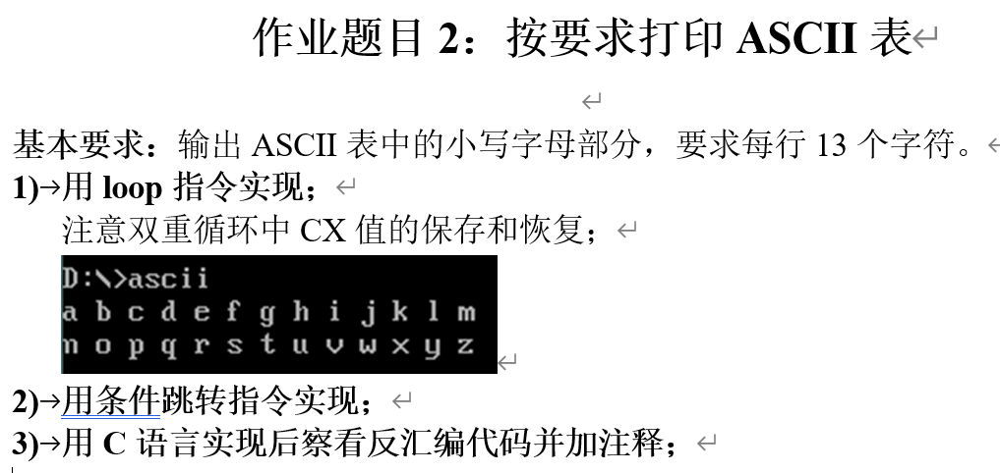
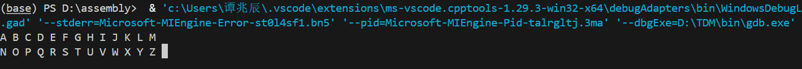

# second homework

任务内容：


## 一、通过loop指令实现

### 1. 实现思路
由于输出13个字母后需要换行，因此采用两个loop循环的形式，中间输出换行。对于单一的loop循环，由于循环终止的判断条件是cx!=0，因此可以在内存中申请地址名为tmp的内存，每次将ASCII码为65（第二行是78）+13-cx的值赋给内存tmp，通过中断指令int 21h中输出字符命令为ah=02h的命令进行显示，最后再通过loop循环时cx--的特性实现字母的顺序打印。

### 2. 注意细节
1. 在8086中，不允许将两个内存变量进行直接运算，因此我们一般采用寄存器之间相加减再赋值给内存或者内存和寄存器相加减的方式进行运算和求值。
2. 其实没有必要额外定义内存tmp，可以直接采用dl寄存器（ah=02h命令的输出字段），将65/78+13-cx直接赋值给dl，这样较为简略和直观。
3. 换行对应dl=0dh和dl=0ah（两者需要连续输出才可以显示）
4. 如果采用内存tmp方法，赋值/运算时不可以直接使用诸如:add tmp,...或mov tmp,的形式，这样可能会使汇编器识别成地址本身的位数运算导致severe error，因此，我们需要采用这样的形式来显示说明进行运算的是tmp内存地址中的值而不是tmp地址本身：add [tmp],...或mov [tmp],...
5. 注意位数,由于ASCII码小于等于8位，因此只要采用低位寄存器即可，如果使用tmp方法则只需定义db 0（八字节），不需要使用dw 0（十六字节）或dd 0（三十二字节），并且在赋值的时候一定要注意位数对齐，不能出现不同位数的内存/寄存器互相赋值或者运算的情况
### 3. 文件名解释
loop.asm:采用tmp内存地址赋值运算法，实现loop指令打印26个小写英文字母的功能
loop2.asm:采用dl低位寄存器赋值运算法，实现loop指令打印26个小写英文字母的功能
## 二、通过条件跳转指令实现
### 1. 实现思路
和loop循环的实现大同小异，由于需要换行，因此也需要两个条件跳转指令，唯一的区别是由于条件跳转不具备loop循环将cx--的特性，因此需要手动将cx减1再判断是否为0从而实现跳转。
### 2. 注意细节
1. dec cx:和inc cx对应（decline和increase），表示cx--
2. 条件跳转格式：
   cmp i,j
   jne 标号
   cmp ah,bh
   ah=bh,ZF=1
   ah≠bh,ZF=0
   此外还有小于、大于、小于等于、大于等于的判断与标志寄存器的更改，可以通过查表得到
   je/jz：表示相等/结果为0，测试条件ZF=1
   jne/jnz：表示不等/结果不为0，测试条件ZF=0
   才外还有js、jns、...等指令用来判断结果为负、非负、溢出等情况，可以通过查表得到
### 3. 文件名解释
loop3.asm:采用dl低位寄存器赋值运算的方法，实现条件跳转打印26个小写英文字母的功能
## 三、用C语言查看反汇编代码并注释
步骤：
1. 在vscode中进行打断点+F5调试

2. 在调试控制台输入`-exec disassemble \m`
3. 可得到反汇编代码如下
```
2	int main(){
   0x00007ff6ea411591 <+0>:	push   rbp
   0x00007ff6ea411592 <+1>:	mov    rbp,rsp
   0x00007ff6ea411595 <+4>:	sub    rsp,0x30
   0x00007ff6ea411599 <+8>:	call   0x7ff6ea4116c0 <__main>

3	    for(int i=1;i<=13;i++){
   0x00007ff6ea41159e <+13>:	mov    DWORD PTR [rbp-0x4],0x1
   0x00007ff6ea4115a5 <+20>:	jmp    0x7ff6ea4115bf <main+46>
   0x00007ff6ea4115bb <+42>:	add    DWORD PTR [rbp-0x4],0x1
   0x00007ff6ea4115bf <+46>:	cmp    DWORD PTR [rbp-0x4],0xd
   0x00007ff6ea4115c3 <+50>:	jle    0x7ff6ea4115a7 <main+22>

4	        printf("%c ",'A'+i-1);
   0x00007ff6ea4115a7 <+22>:	mov    eax,DWORD PTR [rbp-0x4]
   0x00007ff6ea4115aa <+25>:	add    eax,0x40
   0x00007ff6ea4115ad <+28>:	mov    edx,eax
   0x00007ff6ea4115af <+30>:	lea    rcx,[rip+0x11a4a]        # 0x7ff6ea423000
   0x00007ff6ea4115b6 <+37>:	call   0x7ff6ea411540 <printf>

5	    }
6	    printf("\n");
   0x00007ff6ea4115c5 <+52>:	lea    rcx,[rip+0x11a38]        # 0x7ff6ea423004
   0x00007ff6ea4115cc <+59>:	call   0x7ff6ea411540 <printf>

7	    for(int i=1;i<=13;i++){
   0x00007ff6ea4115d1 <+64>:	mov    DWORD PTR [rbp-0x8],0x1
   0x00007ff6ea4115d8 <+71>:	jmp    0x7ff6ea4115f2 <main+97>
   0x00007ff6ea4115ee <+93>:	add    DWORD PTR [rbp-0x8],0x1
   0x00007ff6ea4115f2 <+97>:	cmp    DWORD PTR [rbp-0x8],0xd
   0x00007ff6ea4115f6 <+101>:	jle    0x7ff6ea4115da <main+73>

8	        printf("%c ",'A'+i+13-1);
   0x00007ff6ea4115da <+73>:	mov    eax,DWORD PTR [rbp-0x8]
   0x00007ff6ea4115dd <+76>:	add    eax,0x4d
   0x00007ff6ea4115e0 <+79>:	mov    edx,eax
   0x00007ff6ea4115e2 <+81>:	lea    rcx,[rip+0x11a17]        # 0x7ff6ea423000
   0x00007ff6ea4115e9 <+88>:	call   0x7ff6ea411540 <printf>

9	    }
10	    return 0;
   0x00007ff6ea4115f8 <+103>:	mov    eax,0x0

11	}
=> 0x00007ff6ea4115fd <+108>:	add    rsp,0x30
   0x00007ff6ea411601 <+112>:	pop    rbp
   0x00007ff6ea411602 <+113>:	ret   
```

### main 函数序言 + 调 __main

```
0x00007ff6ea411591 <+0>:  push rbp
; 保存旧的基址指针 rbp（建立栈帧用）

0x00007ff6ea411592 <+1>:  mov rbp,rsp
; rbp = rsp，把当前栈顶作为当前函数的“栈帧基址”

0x00007ff6ea411595 <+4>:  sub rsp,0x30
; rsp -= 0x30，在栈上开 48 字节局部变量空间（并满足对齐等需求）

0x00007ff6ea411599 <+8>:  call 0x7ff6ea4116c0 <__main>
; 调用运行库初始化入口（MinGW/MSVC 常见：做 C 运行时初始化）
```

------

### 第一个 for 循环：for(int i=1;i<=13;i++)

```
0x00007ff6ea41159e <+13>: mov DWORD PTR [rbp-0x4],0x1
; i = 1
; 把 1 写到栈上局部变量 i（位于 rbp-4）

0x00007ff6ea4115a5 <+20>: jmp 0x7ff6ea4115bf <main+46>
; 无条件跳到循环条件判断处（先判断再进入循环体）

0x00007ff6ea4115bb <+42>: add DWORD PTR [rbp-0x4],0x1
; i++（循环末尾自增）

0x00007ff6ea4115bf <+46>: cmp DWORD PTR [rbp-0x4],0xd
; 比较 i 和 13（0xD = 13），相当于判断 i ? 13

0x00007ff6ea4115c3 <+50>: jle 0x7ff6ea4115a7 <main+22>
; 如果 i <= 13，则跳到循环体开始（main+22）
; 否则循环结束
```

------

### 第一个循环体：printf("%c ",'A'+i-1)

```
0x00007ff6ea4115a7 <+22>: mov eax,DWORD PTR [rbp-0x4]
; eax = i（把 i 从内存读到 eax）

0x00007ff6ea4115aa <+25>: add eax,0x40
; eax += 0x40
; 0x40 = 64，所以 eax = i + 64
; 当 i=1 => eax=65='A'，等价于 'A'+i-1

0x00007ff6ea4115ad <+28>: mov edx,eax
; Windows x64 调用约定：第2个参数放 rdx/edx
; edx = 要打印的字符值（实际 printf 的 %c 参数）

0x00007ff6ea4115af <+30>: lea rcx,[rip+0x11a4a]  # 0x7ff6ea423000
; Windows x64：第1个参数放 rcx
; rcx = 格式字符串地址 "%c "（或类似的常量字符串）
; lea 是“取地址”，rip 相对寻址拿到常量区地址

0x00007ff6ea4115b6 <+37>: call 0x7ff6ea411540 <printf>
; 调用 printf(rcx, edx)
; 即 printf("%c ", i+64)
```

------

### printf("\n")

```
0x00007ff6ea4115c5 <+52>: lea rcx,[rip+0x11a38]  # 0x7ff6ea423004
; rcx = "\n" 字符串地址（printf 的第1个参数）

0x00007ff6ea4115cc <+59>: call 0x7ff6ea411540 <printf>
; 调用 printf("\n")
```

------

### 第二个 for 循环：for(int i=1;i<=13;i++)

```
0x00007ff6ea4115d1 <+64>: mov DWORD PTR [rbp-0x8],0x1
; i = 1
; 这次 i 用的是另一个栈位置（rbp-8）

0x00007ff6ea4115d8 <+71>: jmp 0x7ff6ea4115f2 <main+97>
; 跳到循环条件判断处

0x00007ff6ea4115ee <+93>: add DWORD PTR [rbp-0x8],0x1
; i++（循环末尾自增）

0x00007ff6ea4115f2 <+97>: cmp DWORD PTR [rbp-0x8],0xd
; 比较 i 和 13

0x00007ff6ea4115f6 <+101>: jle 0x7ff6ea4115da <main+73>
; 如果 i <= 13，跳到循环体
```

------

### 第二个循环体：printf("%c ",'A'+i+13-1)

```
0x00007ff6ea4115da <+73>: mov eax,DWORD PTR [rbp-0x8]
; eax = i

0x00007ff6ea4115dd <+76>: add eax,0x4d
; eax += 0x4D (=77)
; 当 i=1 => eax=78='N'
; 对应 'A'+i+13-1 = 'A'+i+12 = 65 + i + 12 = i + 77

0x00007ff6ea4115e0 <+79>: mov edx,eax
; edx = 第2个参数（%c 对应的字符）

0x00007ff6ea4115e2 <+81>: lea rcx,[rip+0x11a17]  # 0x7ff6ea423000
; rcx = "%c " 格式字符串地址（和前面同一个）

0x00007ff6ea4115e9 <+88>: call 0x7ff6ea411540 <printf>
; printf("%c ", i+77)  打印 N 到 Z
```

------

### return 0 + 函数尾声

```
0x00007ff6ea4115f8 <+103>: mov eax,0x0
; 返回值 eax = 0（C 的 return 0）

0x00007ff6ea4115fd <+108>: add rsp,0x30
; 回收局部变量栈空间：rsp += 0x30

0x00007ff6ea411601 <+112>: pop rbp
; 恢复旧的 rbp

0x00007ff6ea411602 <+113>: ret
; 返回到调用者
```