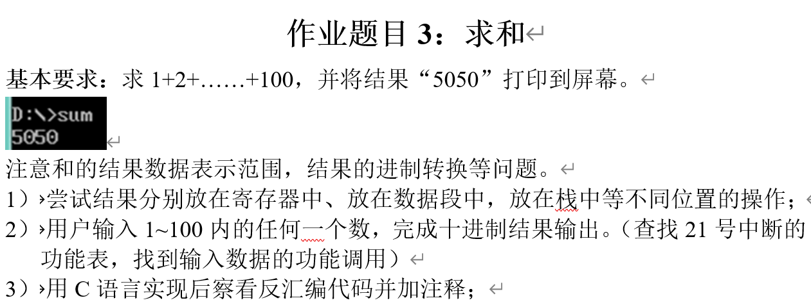
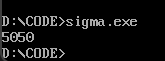
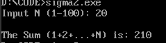
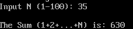
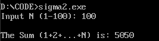

# third homework
任务内容：


## 一、基本要求
代码对应sigma.asm
### 任务说明
输出计算1+2+3+...+100的和
### 输出结果


## 二、结果放在不同位置的对比

### 1. 结果存放在寄存器中（如 AX）

#### 做法说明

在循环过程中，直接使用寄存器保存累加结果，例如始终用 AX 保存当前求和值：

- CX 作为循环计数器
- AX 作为累加器
- 每次循环执行 `add ax, cx`

最终结果直接保存在 AX 中，后续可直接调用输出函数。

#### 特点分析

- **优点**
  - 访问速度最快（寄存器位于 CPU 内部）
  - 指令简单，效率高
  - 适合短生命周期、中间计算结果
- **缺点**
  - 寄存器数量有限
  - 一旦调用子程序或中断，若未保存寄存器，结果容易被破坏
  - 不适合长期保存或跨过程使用的数据

#### 适用场景

- 循环中的中间结果
- 简单计算、临时变量

------

### 2. 结果存放在数据段中（如 sum）

#### 做法说明

是我当前程序采用的方式

```
.data
    sum dw 0
```

在循环中直接对内存变量操作：

```
add sum, cx
```

循环结束后再：

```
mov ax, sum
```

将结果取回寄存器用于输出。

#### 特点分析

- **优点**
  - 数据可以长期保存，生命周期长
  - 不受寄存器数量限制
  - 便于程序结构清晰、结果可重复访问
- **缺点**
  - 访问内存速度慢于寄存器
  - 每次读写都需要经过总线

#### 适用场景

- 最终计算结果
- 需要在多个过程之间共享的数据
- 需要持久保存的变量

------

### 3. 结果存放在栈中（Stack）

#### 做法说明

可以在计算结束后，将结果压入栈中保存，例如：

```
push ax
```

在需要使用时再：

```
pop ax
```

在我的 `print_num` 过程中，也大量使用了栈来保存 AX、BX、CX、DX，防止子程序破坏主程序的数据。

#### 特点分析

- **优点**
  - 利用 LIFO 特性，方便临时保存和恢复寄存器
  - 在过程调用、中断处理中非常安全
  - 不需要额外的数据段变量
- **缺点**
  - 只能按顺序访问，灵活性不如数据段
  - 栈空间有限，使用不当可能导致栈溢出
  - 不适合保存长期存在的数据

### 适用场景

- 子程序调用时保护寄存器
- 临时保存计算结果
- 参数传递、返回值管理

## 三、进阶任务
代码对应sigma2.asm
### 任务要求
用户输入1~100内的任何一个数，完成十进制结果输出
### 输出示例
#### 1. 输入n=20

#### 2. 输入n=35

#### 3. 输入n=100

## 四、用C语言查看反汇编代码并注释
反汇编代码如下：
```
3 int main(){
   ; --- 函数序言 (Prologue) ---
   0x00007ff7f6ca15e2 <+0>: push   rbp            ; 将调用者的基址指针压栈备份
   0x00007ff7f6ca15e3 <+1>: mov    rbp,rsp        ; 设置当前函数的栈帧基址
   0x00007ff7f6ca15e6 <+4>: sub    rsp,0x30       ; 在栈上分配 48 字节空间 (用于存放 tmp, n, i)
   0x00007ff7f6ca15ea <+8>: call   0x7ff7f6ca16f0 ; 调用 __main (MinGW/GCC 环境下的初始化)

4     int tmp=0,n;
   0x00007ff7f6ca15ef <+13>:  mov    DWORD PTR [rbp-0x4],0x0  ; [rbp-4] 是 tmp，将其初始化为 0

5     scanf("%d",&n);
   0x00007ff7f6ca15f6 <+20>:  lea    rax,[rbp-0xc]  ; [rbp-12] 是 n，取出它的地址存入 rax
   0x00007ff7f6ca15fa <+24>:  mov    rdx,rax        ; 将 n 的地址存入 rdx (scanf 的第二个参数)
   0x00007ff7f6ca15fd <+27>:  lea    rcx,[rip+0x189fc] ; 取出 "%d" 字符串的地址存入 rcx (第一个参数)
   0x00007ff7f6ca1604 <+34>:  call   0x7ff7f6ca1540    ; 调用 scanf

6     for(int i=1;i<=n;i++){
   ; --- 循环初始化 ---
   0x00007ff7f6ca1609 <+39>:  mov    DWORD PTR [rbp-0x8],0x1  ; [rbp-8] 是 i，初始化 i = 1
   0x00007ff7f6ca1610 <+46>:  jmp    0x7ff7f6ca161c           ; 无条件跳到下面的比较环节 (main+58)

   ; --- 循环增量更新 (i++) ---
   0x00007ff7f6ca1618 <+54>:  add    DWORD PTR [rbp-0x8],0x1  ; i = i + 1

   ; --- 循环条件判断 (i <= n) ---
   0x00007ff7f6ca161c <+58>:  mov    eax,DWORD PTR [rbp-0xc]  ; 将 n 的值读入 eax
   0x00007ff7f6ca161f <+61>:  cmp    DWORD PTR [rbp-0x8],eax  ; 比较 i 和 n
   0x00007ff7f6ca1622 <+64>:  jle    0x7ff7f6ca1612           ; 如果 i <= n，跳到循环体执行 (main+48)

7          tmp+=i;
   ; --- 循环体执行 ---
   0x00007ff7f6ca1612 <+48>:  mov    eax,DWORD PTR [rbp-0x8]  ; 取出 i 的值
   0x00007ff7f6ca1615 <+51>:  add    DWORD PTR [rbp-0x4],eax  ; 将 i 加到 tmp 上 (tmp = tmp + i)

8     }

9     printf("%d\n",tmp);
   0x00007ff7f6ca1624 <+66>:  mov    eax,DWORD PTR [rbp-0x4]  ; 取出累加后的 tmp 值
   0x00007ff7f6ca1627 <+69>:  mov    edx,eax        ; 将 tmp 放入 edx (printf 的第二个参数)
   0x00007ff7f6ca1629 <+71>:  lea    rcx,[rip+0x189d3] ; 取出 "%d\n" 的地址放入 rcx (第一个参数)
   0x00007ff7f6ca1630 <+78>:  call   0x7ff7f6ca1591    ; 调用 printf

10      return 0;
   0x00007ff7f6ca1635 <+83>:  mov    eax,0x0        ; 将返回值 0 存入 eax

11  }
   ; --- 函数收尾 (Epilogue) ---
=> 0x00007ff7f6ca163a <+88>:  add    rsp,0x30       ; 释放 48 字节的栈空间
   0x00007ff7f6ca163e <+92>:  pop    rbp            ; 恢复旧的基址指针
   0x00007ff7f6ca163f <+93>:  ret                   ; 函数返回
```